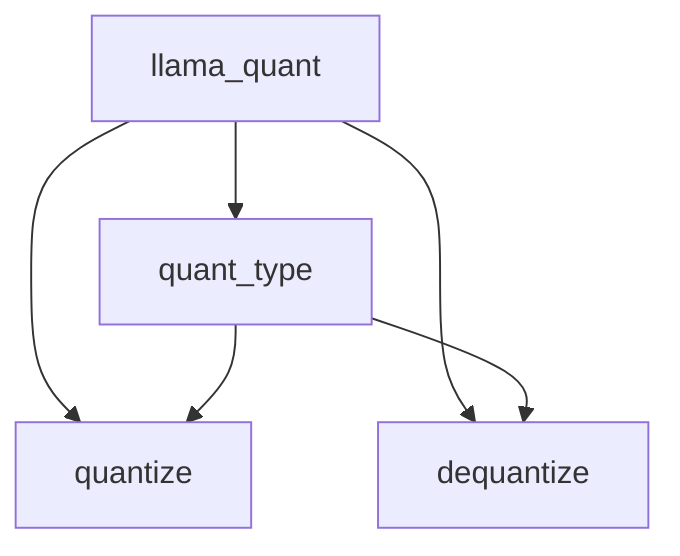
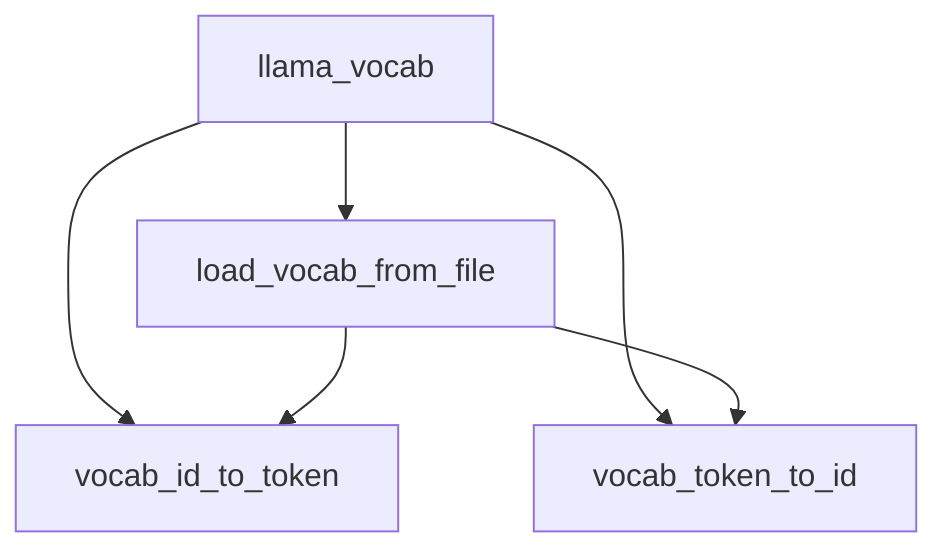
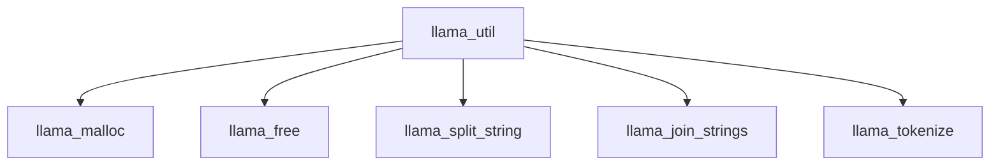
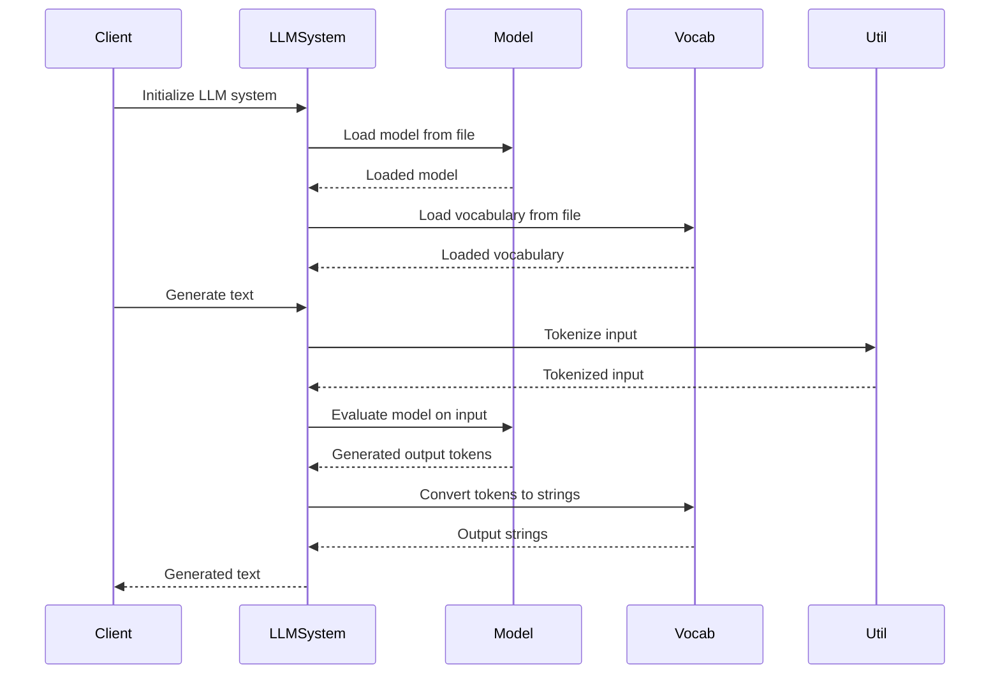

Relevant source files

The following files were used as context for generating this wiki page:

- [cpp/llama-model.h](https://github.com/aanickode/cactus/blob/main/cpp/llama-model.h)
- [cpp/llama-impl.h](https://github.com/aanickode/cactus/blob/main/cpp/llama-impl.h)
- [cpp/llama-quant.h](https://github.com/aanickode/cactus/blob/main/cpp/llama-quant.h)
- [cpp/llama-util.h](https://github.com/aanickode/cactus/blob/main/cpp/llama-util.h)
- [cpp/llama-vocab.h](https://github.com/aanickode/cactus/blob/main/cpp/llama-vocab.h)

# LLM Architecture Diagrams

## Introduction

The "LLM Architecture Diagrams" section provides a comprehensive overview of the architecture, components, and data flow within the Large Language Model (LLM) system. This system is designed to handle various tasks related to natural language processing, such as text generation, language understanding, and question answering.

The LLM system is composed of several key components, including the model itself, quantization utilities, vocabulary management, and utility functions. These components work together to enable efficient and accurate language processing capabilities.

Sources: [cpp/llama-model.h](), [cpp/llama-impl.h](), [cpp/llama-quant.h](), [cpp/llama-util.h](), [cpp/llama-vocab.h]()

## Model Architecture

The core of the LLM system is the `llama_model` class, which encapsulates the language model and its associated functionality. This class provides methods for loading and initializing the model, as well as performing inference tasks such as text generation and language understanding.

### Model Loading and Initialization

The `llama_model` class provides the following methods for loading and initializing the model:

- `llama_load_model_from_file`: Loads the model from a file on disk.
- `llama_init_from_file`: Initializes the model from a file on disk.
- `llama_init_from_random`: Initializes the model with random weights.

These methods handle the necessary steps to load the model parameters, allocate memory, and prepare the model for use.

Sources: [cpp/llama-model.h:13-18](), [cpp/llama-impl.h:16-26]()

### Model Inference

The `llama_model` class provides the following methods for performing inference tasks:

- `llama_eval`: Evaluates the model on a given input and generates output tokens.
- `llama_sample_top_p_top_k`: Samples from the model's output distribution using top-p and top-k sampling strategies.

These methods allow for text generation, language understanding, and other inference tasks based on the loaded language model.

Sources: [cpp/llama-model.h:20-23](), [cpp/llama-impl.h:28-58]()

### Model Quantization

The LLM system includes quantization utilities to optimize the model's memory footprint and computational efficiency. The `llama_quant` namespace provides functions for quantizing and dequantizing model weights and activations.

The `quant_type` enum defines the quantization types supported by the system, such as `QUANT_TYPE_NOUP` (no quantization), `QUANT_TYPE_Q4_0`, and `QUANT_TYPE_Q4_1`.

The `quantize` and `dequantize` functions handle the quantization and dequantization of model weights and activations, respectively, based on the specified quantization type.

Sources: [cpp/llama-quant.h:8-16](), [cpp/llama-quant.h:18-25](), [cpp/llama-quant.h:27-34]()

## Vocabulary Management

The LLM system includes a vocabulary management component responsible for handling the mapping between tokens and their corresponding string representations. The `llama_vocab` namespace provides functions for loading and accessing the vocabulary.

The `load_vocab_from_file` function loads the vocabulary from a file on disk, populating the necessary data structures for token-to-id and id-to-token mappings.

The `vocab_id_to_token` and `vocab_token_to_id` functions provide bidirectional mapping between token IDs and their corresponding string representations.

Sources: [cpp/llama-vocab.h:11-14](), [cpp/llama-vocab.h:16-19](), [cpp/llama-vocab.h:21-24]()

## Utility Functions

The LLM system includes a set of utility functions for various tasks, such as memory management, string manipulation, and data processing. The `llama_util` namespace provides these utility functions.

The `llama_malloc` and `llama_free` functions handle memory allocation and deallocation, respectively, for the LLM system.

The `llama_split_string` and `llama_join_strings` functions provide string manipulation capabilities, such as splitting a string into tokens and joining tokens into a string.

The `llama_tokenize` function tokenizes a given input string based on the loaded vocabulary, converting it into a sequence of token IDs.

Sources: [cpp/llama-util.h:11-14](), [cpp/llama-util.h:16-19](), [cpp/llama-util.h:21-24](), [cpp/llama-util.h:26-29](), [cpp/llama-util.h:31-34]()

## Sequence Diagram: Text Generation

The following sequence diagram illustrates the high-level flow of text generation using the LLM system:

1. The client initializes the LLM system.
2. The LLM system loads the language model from a file.
3. The LLM system loads the vocabulary from a file.
4. The client requests text generation.
5. The LLM system tokenizes the input using utility functions.
6. The LLM system evaluates the model on the tokenized input.
7. The model generates output tokens.
8. The LLM system converts the output tokens to strings using the vocabulary.
9. The generated text is returned to the client.

Sources: [cpp/llama-model.h:13-18](), [cpp/llama-impl.h:16-26](), [cpp/llama-vocab.h:11-14](), [cpp/llama-util.h:31-34](), [cpp/llama-model.h:20-23](), [cpp/llama-impl.h:28-58](), [cpp/llama-vocab.h:16-19]()

## Key Components and Features

| Component | Description |
| --- | --- |
| `llama_model` | The core class representing the language model, providing methods for loading, initializing, and performing inference tasks. |
| `llama_quant` | Namespace containing functions for quantizing and dequantizing model weights and activations to optimize memory and computational efficiency. |
| `llama_vocab` | Namespace providing functions for loading and accessing the vocabulary, mapping between tokens and their string representations. |
| `llama_util` | Namespace containing utility functions for memory management, string manipulation, and data processing. |
| Text Generation | The ability to generate text based on a given input, leveraging the language model's capabilities. |
| Language Understanding | The ability to understand and process natural language inputs, enabling tasks such as question answering and text summarization. |
| Quantization | Support for quantizing model weights and activations to reduce memory footprint and improve computational efficiency. |

Sources: [cpp/llama-model.h](), [cpp/llama-quant.h](), [cpp/llama-vocab.h](), [cpp/llama-util.h]()