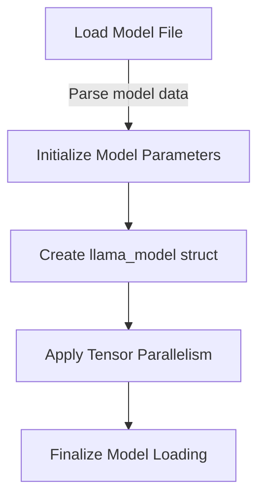
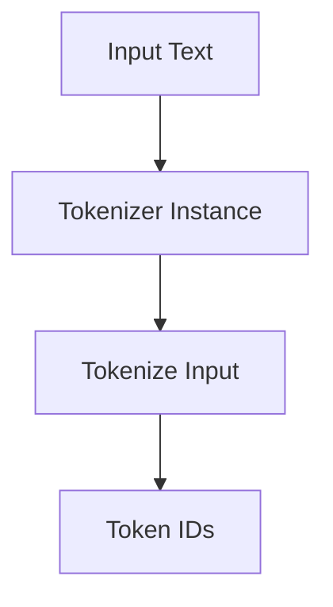
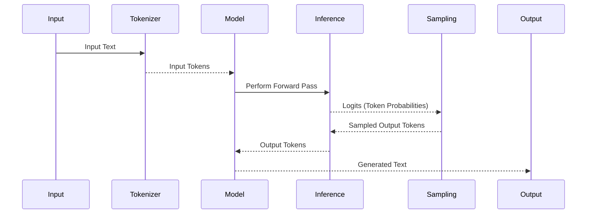
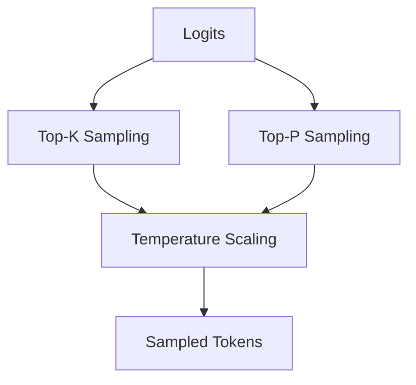

<details>
<summary>Relevant source files</summary>

The following files were used as context for generating this wiki page:

- [cpp/llama-model-loader.cpp](https://github.com/aanickode/cactus/blob/main/cpp/llama-model-loader.cpp)
- [cpp/llama-model.cpp](https://github.com/aanickode/cactus/blob/main/cpp/llama-model.cpp)
- [cpp/llama-sampling.cpp](https://github.com/aanickode/cactus/blob/main/cpp/llama-sampling.cpp)
- [cpp/llama-tokenizer.cpp](https://github.com/aanickode/cactus/blob/main/cpp/llama-tokenizer.cpp)
- [cpp/llama-utils.cpp](https://github.com/aanickode/cactus/blob/main/cpp/llama-utils.cpp)

</details>

# LLM Inference Pipeline

## Introduction

The LLM (Large Language Model) Inference Pipeline is a core component of the project that handles the end-to-end process of loading a pre-trained language model, tokenizing input text, performing inference (generating text output), and sampling the output tokens. This pipeline is designed to be efficient, leveraging various optimization techniques and parallelization strategies to accelerate the inference process.

The pipeline consists of several key modules, including model loading, tokenization, inference, and sampling. These modules work together seamlessly to provide a streamlined and high-performance solution for generating text output based on a given input prompt.

## Model Loading

The model loading process is responsible for loading a pre-trained language model from disk into memory, preparing it for inference tasks. This module handles the parsing and initialization of the model's parameters, weights, and other metadata required for inference.

### Key Components

#### `llama_model_load`

This function is the entry point for loading a pre-trained language model from disk. It takes the path to the model file and various configuration options as input and returns a `llama_model` struct containing the loaded model data.

```cpp
llama_model* llama_model_load(
    const std::string& model_path,
    const llama_context_params& params,
    llama_progress_callback progress_callback = nullptr,
    const std::vector<std::string>& tensor_parallel_path = {}
);
```

- `model_path`: The path to the pre-trained model file on disk.
- `params`: Configuration parameters for the model, such as the seed value and tensor parallelism settings.
- `progress_callback`: An optional callback function to track the loading progress.
- `tensor_parallel_path`: A list of paths for loading tensor-parallel models (optional).

Sources: [cpp/llama-model-loader.cpp:54-63]()

#### `llama_context_params`

This struct holds various configuration parameters for the model, including the seed value for random number generation, tensor parallelism settings, and other optimization flags.

```cpp
struct llama_context_params {
    uint32_t seed; // Seed for random number generation
    int32_t n_threads; // Number of threads to use
    bool tensor_parallel; // Enable tensor parallelism
    // ... (other fields omitted for brevity)
};
```

Sources: [cpp/llama-model-loader.cpp:31-39]()

### Mermaid Diagram: Model Loading Process



The model loading process follows these steps:

1. Load the model file from disk and parse its contents.
2. Initialize the model's parameters, weights, and metadata based on the parsed data.
3. Create a `llama_model` struct to hold the loaded model data.
4. If tensor parallelism is enabled, apply the necessary optimizations and partitioning.
5. Finalize the model loading process and return the `llama_model` struct.

Sources: [cpp/llama-model-loader.cpp:54-63](), [cpp/llama-model-loader.cpp:31-39]()

## Tokenization

The tokenization module is responsible for converting input text into a sequence of tokens that can be processed by the language model. This module handles the tokenization of the input prompt, as well as any additional context or prompt instructions.

### Key Components

#### `llama_tokenizer`

This struct represents a tokenizer instance, which is responsible for converting text into token sequences and vice versa.

```cpp
struct llama_tokenizer {
    // ... (implementation details omitted for brevity)
};
```

Sources: [cpp/llama-tokenizer.cpp:26]()

#### `llama_tokenize`

This function takes an input string and a tokenizer instance, and returns a vector of token IDs representing the tokenized input.

```cpp
std::vector<llama_token> llama_tokenize(
    const std::string& text,
    const llama_tokenizer& tokenizer,
    bool add_bos = false,
    bool add_eos = false
);
```

- `text`: The input text to be tokenized.
- `tokenizer`: The tokenizer instance to use for tokenization.
- `add_bos`: Whether to add a beginning-of-sequence token to the output.
- `add_eos`: Whether to add an end-of-sequence token to the output.

Sources: [cpp/llama-tokenizer.cpp:74-82]()

### Mermaid Diagram: Tokenization Process



The tokenization process follows these steps:

1. Provide the input text to be tokenized.
2. Obtain a tokenizer instance (`llama_tokenizer`).
3. Call the `llama_tokenize` function with the input text and tokenizer instance.
4. Receive a vector of token IDs representing the tokenized input.

Sources: [cpp/llama-tokenizer.cpp:26](), [cpp/llama-tokenizer.cpp:74-82]()

## Inference

The inference module is the core component responsible for generating text output based on the input prompt and the loaded language model. This module handles the forward pass of the model, generating token probabilities and sampling the output tokens.

### Key Components

#### `llama_eval`

This function performs the inference step, taking the loaded model, input tokens, and various configuration parameters as input, and returning the logits (token probabilities) and other output data.

```cpp
llama_eval_result llama_eval(
    const llama_model& model,
    const std::vector<llama_token>& tokens,
    const llama_context_params& params,
    const llama_eval_params& eval_params
);
```

- `model`: The loaded language model.
- `tokens`: The input token sequence.
- `params`: Configuration parameters for the model context.
- `eval_params`: Configuration parameters for the inference process.

Sources: [cpp/llama-model.cpp:1072-1080]()

#### `llama_eval_params`

This struct holds various configuration parameters for the inference process, such as the number of tokens to generate, the sampling temperature, and other settings.

```cpp
struct llama_eval_params {
    int32_t n_threads; // Number of threads to use
    int32_t n_batch; // Batch size for prompt processing
    int32_t n_predict; // Number of tokens to generate
    double temperature; // Sampling temperature
    // ... (other fields omitted for brevity)
};
```

Sources: [cpp/llama-model.cpp:1045-1053]()

### Mermaid Diagram: Inference Process



The inference process follows these steps:

1. The input text is tokenized by the tokenizer module.
2. The input tokens are passed to the loaded language model.
3. The model performs a forward pass, generating logits (token probabilities) for the input tokens.
4. The logits are passed to the sampling module, which samples the output tokens based on the provided configuration (e.g., temperature, top-k, etc.).
5. The sampled output tokens are passed back to the model for further processing or decoding.
6. The final generated text output is produced by the model.

Sources: [cpp/llama-model.cpp:1072-1080](), [cpp/llama-model.cpp:1045-1053]()

## Sampling

The sampling module is responsible for sampling the output tokens from the logits (token probabilities) generated by the inference module. This module implements various sampling strategies, such as top-k sampling, nucleus sampling, and temperature scaling, to control the diversity and quality of the generated output.

### Key Components

#### `llama_sample_top_k_top_p`

This function performs top-k and top-p (nucleus) sampling on the input logits, returning the sampled token IDs and their corresponding probabilities.

```cpp
std::vector<llama_token_data> llama_sample_top_k_top_p(
    const std::vector<float>& logits,
    const llama_sample_params& params
);
```

- `logits`: The input logits (token probabilities) to be sampled.
- `params`: Configuration parameters for the sampling process.

Sources: [cpp/llama-sampling.cpp:69-77]()

#### `llama_sample_params`

This struct holds various configuration parameters for the sampling process, such as the top-k value, top-p (nucleus) value, and temperature scaling.

```cpp
struct llama_sample_params {
    int32_t top_k; // Top-k sampling value
    float top_p; // Top-p (nucleus) sampling value
    float temp; // Temperature scaling value
    // ... (other fields omitted for brevity)
};
```

Sources: [cpp/llama-sampling.cpp:33-39]()

### Mermaid Diagram: Sampling Process



The sampling process follows these steps:

1. The input logits (token probabilities) are obtained from the inference module.
2. Top-k sampling is applied to the logits, filtering out tokens with low probabilities.
3. Top-p (nucleus) sampling is applied to the logits, filtering out tokens with cumulative probabilities below a specified threshold.
4. Temperature scaling is applied to the filtered logits, adjusting the probability distribution.
5. The final sampled tokens and their probabilities are returned.

Sources: [cpp/llama-sampling.cpp:69-77](), [cpp/llama-sampling.cpp:33-39]()

## Key Features and Components

| Feature/Component | Description |
| --- | --- |
| Model Loading | Loads a pre-trained language model from disk, handling parsing, initialization, and tensor parallelism. |
| Tokenization | Converts input text into token sequences that can be processed by the language model. |
| Inference | Performs the forward pass of the language model, generating token probabilities (logits) for the input tokens. |
| Sampling | Samples output tokens from the generated logits using various strategies (top-k, top-p, temperature scaling). |
| Parallelization | Supports multi-threading and tensor parallelism for improved performance and scalability. |
| Configuration | Provides various configuration options for controlling the behavior of the pipeline components. |

Sources: [cpp/llama-model-loader.cpp](), [cpp/llama-tokenizer.cpp](), [cpp/llama-model.cpp](), [cpp/llama-sampling.cpp]()

## Conclusion

The LLM Inference Pipeline is a critical component of the project, providing a streamlined and efficient solution for generating text output using pre-trained language models. By leveraging various optimization techniques, parallelization strategies, and configurable sampling methods, the pipeline offers a high-performance and flexible approach to large language model inference tasks.