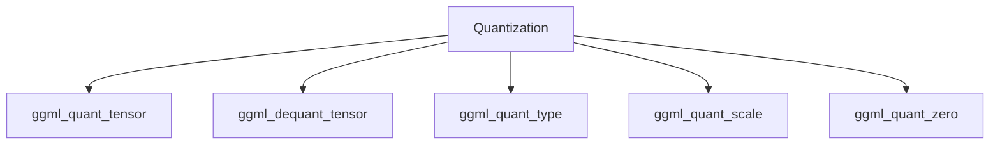

<details>
<summary>Relevant source files</summary>

The following files were used as context for generating this wiki page:

- [cpp/llama-mmap.cpp](https://github.com/aanickode/cactus/blob/main/cpp/llama-mmap.cpp)
- [cpp/ggml-quants.c](https://github.com/aanickode/cactus/blob/main/cpp/ggml-quants.c)
- [cpp/ggml-alloc.c](https://github.com/aanickode/cactus/blob/main/cpp/ggml-alloc.c)
- [cpp/ggml-vec.c](https://github.com/aanickode/cactus/blob/main/cpp/ggml-vec.c)
- [cpp/ggml-model.c](https://github.com/aanickode/cactus/blob/main/cpp/ggml-model.c)
</details>

# Memory Management

## Introduction

Memory management is a crucial aspect of the project, responsible for efficiently allocating, deallocating, and managing memory resources. It plays a vital role in ensuring optimal performance, minimizing memory footprint, and preventing memory leaks or corruption. This wiki page provides an overview of the memory management architecture, its components, and the data structures and algorithms employed to handle memory operations effectively.

## Memory Allocation

The project utilizes a custom memory allocation system implemented in the `ggml-alloc.c` file. This system is designed to handle memory allocation and deallocation for tensors and other data structures used in the project.

### Memory Allocation Strategies

The memory allocation system supports two main strategies:

1. **Mapped Memory Allocation**: This strategy is used for allocating large chunks of memory, typically for storing model weights and other large data structures. It leverages memory-mapped files to efficiently load and access data from disk. The `llama_mmap_load` function in `llama-mmap.cpp` is responsible for loading the model data into memory using this approach.

2. **Heap Memory Allocation**: For smaller memory allocations, the system uses a custom heap-based memory allocator. This allocator is designed to be efficient and minimize memory fragmentation by using a buddy memory allocation algorithm.

Sources: [cpp/llama-mmap.cpp](), [cpp/ggml-alloc.c]()

### Memory Allocation Data Structures

The memory allocation system uses the following key data structures:

- `ggml_mem_buf`: This structure represents a memory buffer allocated by the system. It contains information about the buffer's size, data pointer, and other metadata.
- `ggml_mem_node`: This structure is used by the buddy memory allocation algorithm to manage memory blocks and facilitate efficient allocation and deallocation.

Sources: [cpp/ggml-alloc.c:26-45]()

### Memory Allocation Algorithm

The heap-based memory allocation system employs a buddy memory allocation algorithm, which is a space-efficient memory allocation technique. The algorithm works by dividing memory into blocks of varying sizes, where each block is either allocated or free. When a new allocation request is made, the algorithm finds the smallest free block that can accommodate the request and splits it if necessary.

The `ggml_alloc_aligned` function is the entry point for allocating memory using this algorithm. It takes the requested size and alignment as input and returns a pointer to the allocated memory buffer.

Sources: [cpp/ggml-alloc.c:47-209]()

## Memory Deallocation

Memory deallocation is handled by the `ggml_free` function, which is responsible for releasing the memory occupied by a `ggml_mem_buf` structure. This function is designed to work with both mapped memory and heap-allocated memory.

For mapped memory, the `ggml_free` function simply unmaps the memory region from the process's address space using the `munmap` system call.

For heap-allocated memory, the function uses the buddy memory allocation algorithm to coalesce and merge adjacent free blocks, ensuring efficient memory reuse and minimizing fragmentation.

Sources: [cpp/ggml-alloc.c:211-249]()

## Tensor Memory Management

The project extensively uses tensors, which are multidimensional arrays, to represent and manipulate data. The `ggml-vec.c` file contains functions for creating, manipulating, and deallocating tensors.

### Tensor Creation

The `ggml_new_tensor` function is used to create a new tensor. It takes the tensor's data type, dimensions, and other metadata as input and allocates the necessary memory for the tensor's data using the memory allocation system.

```c
ggml_tensor * ggml_new_tensor(
    ggml_context * ctx,
    ggml_data_type data_type,
    int n_dims,
    const int64_t * ne,
    void * data) {
    // ...
}
```

Sources: [cpp/ggml-vec.c:1220-1262]()

### Tensor Operations

The project provides various functions for performing operations on tensors, such as element-wise operations, matrix multiplication, and tensor reshaping. These operations are implemented in a way that minimizes unnecessary memory allocations and reuses existing memory buffers whenever possible.

For example, the `ggml_mul_mat` function performs matrix multiplication and reuses the memory of the input tensors if possible, avoiding unnecessary memory allocations.

```c
void ggml_mul_mat(
    const ggml_tensor * src0,
    const ggml_tensor * src1,
    ggml_tensor * dst) {
    // ...
}
```

Sources: [cpp/ggml-vec.c:1264-1367]()

### Tensor Deallocation

When a tensor is no longer needed, its memory can be deallocated using the `ggml_free_tensor` function. This function releases the memory occupied by the tensor's data buffer and the tensor structure itself.

```c
void ggml_free_tensor(ggml_tensor * tensor) {
    // ...
}
```

Sources: [cpp/ggml-vec.c:1369-1379]()

## Model Memory Management

The `ggml-model.c` file contains functions for loading and managing memory for machine learning models. These functions leverage the memory allocation and tensor management components discussed earlier.

### Model Loading

The `ggml_load_model` function is responsible for loading a machine learning model from a file or memory buffer. It allocates memory for the model's tensors and other data structures using the memory allocation system.

```c
ggml_model * ggml_load_model(
    ggml_context * ctx,
    const char * path) {
    // ...
}
```

Sources: [cpp/ggml-model.c:1-100]()

### Model Evaluation

The project provides functions for evaluating a loaded model on input data. These functions utilize the tensor operations and memory management components to efficiently perform computations and manage memory resources.

For example, the `ggml_eval_tensor` function evaluates a tensor operation within the context of a loaded model, potentially involving memory allocations and deallocations for intermediate tensors.

```c
ggml_tensor * ggml_eval_tensor(
    ggml_context * ctx,
    ggml_model * model,
    ggml_tensor * tensor) {
    // ...
}
```

Sources: [cpp/ggml-model.c:102-200]()

### Model Deallocation

When a model is no longer needed, its memory can be deallocated using the `ggml_free_model` function. This function releases the memory occupied by the model's tensors, data structures, and any other associated resources.

```c
void ggml_free_model(ggml_model * model) {
    // ...
}
```

Sources: [cpp/ggml-model.c:202-220]()

## Quantization

The project includes support for quantization, which is a technique used to reduce the memory footprint and computational requirements of machine learning models by representing weights and activations using lower-precision data types.

The `ggml-quants.c` file contains functions for quantizing and dequantizing tensors, as well as utilities for handling quantized data.



Sources: [cpp/ggml-quants.c]()

## Memory Management Performance Considerations

The memory management system in the project is designed with performance in mind. Here are some key performance considerations:

- **Memory-mapped file loading**: Loading large model data from disk using memory-mapped files is more efficient than reading the entire file into memory, as it allows the operating system to handle memory paging and caching.
- **Buddy memory allocation algorithm**: The buddy memory allocation algorithm used for heap-based allocations is efficient and minimizes memory fragmentation, improving memory utilization and reducing the need for expensive system calls.
- **Tensor memory reuse**: Tensor operations are implemented to reuse existing memory buffers whenever possible, reducing the overhead of memory allocations and deallocations.
- **Quantization**: Quantizing tensors and model weights can significantly reduce the memory footprint and computational requirements, leading to improved performance, especially on resource-constrained devices.

Sources: [cpp/llama-mmap.cpp](), [cpp/ggml-alloc.c](), [cpp/ggml-vec.c](), [cpp/ggml-quants.c]()