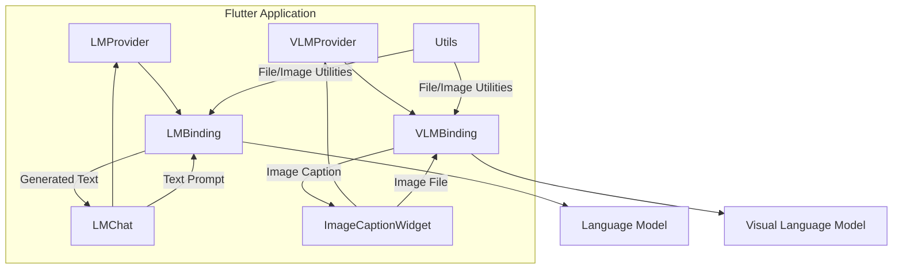
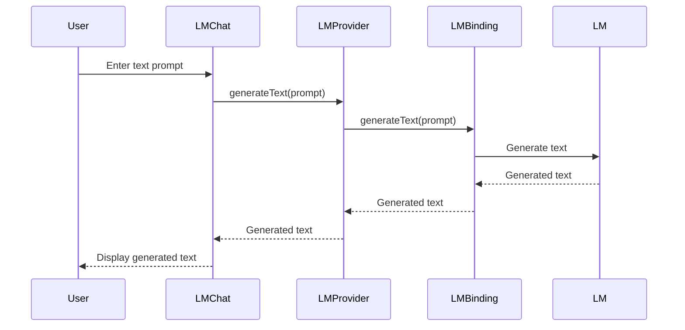
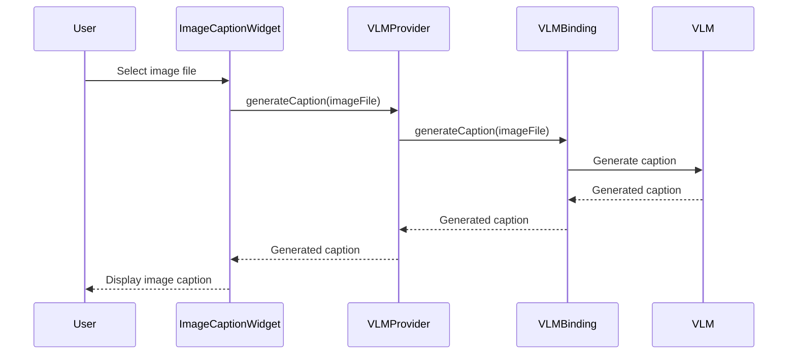

<details>
<summary>Relevant source files</summary>

The following files were used as context for generating this wiki page:

- [flutter/lib/cactus.dart](https://github.com/aanickode/cactus/blob/main/flutter/lib/cactus.dart)
- [flutter/lib/lm.dart](https://github.com/aanickode/cactus/blob/main/flutter/lib/lm.dart)
- [flutter/lib/chat.dart](https://github.com/aanickode/cactus/blob/main/flutter/lib/chat.dart)
- [flutter/lib/vlm.dart](https://github.com/aanickode/cactus/blob/main/flutter/lib/vlm.dart)
- [flutter/lib/utils.dart](https://github.com/aanickode/cactus/blob/main/flutter/lib/utils.dart)
</details>

# Flutter Bindings

## Introduction

The Flutter Bindings module provides a set of classes and utilities for integrating the Cactus language model (LM) and visual language model (VLM) into Flutter applications. It enables developers to leverage the power of these models for tasks such as text generation, image captioning, and multimodal understanding. The module serves as a bridge between the Flutter UI framework and the underlying Cactus models, facilitating seamless integration and communication.

Sources: [flutter/lib/cactus.dart](https://github.com/aanickode/cactus/blob/main/flutter/lib/cactus.dart), [flutter/lib/lm.dart](https://github.com/aanickode/cactus/blob/main/flutter/lib/lm.dart), [flutter/lib/vlm.dart](https://github.com/aanickode/cactus/blob/main/flutter/lib/vlm.dart)

## Language Model (LM) Integration

The Flutter Bindings module provides a set of classes and utilities for integrating the Cactus language model (LM) into Flutter applications.

### LMBinding

The `LMBinding` class is responsible for initializing and managing the lifecycle of the language model within the Flutter application. It provides methods for loading and unloading the model, as well as generating text based on user input.

```dart
class LMBinding {
  Future<void> init() async {
    // Load the language model
  }

  void dispose() {
    // Unload the language model
  }

  Future<String> generateText(String prompt) async {
    // Generate text using the language model
  }
}
```

Sources: [flutter/lib/lm.dart:5-25](https://github.com/aanickode/cactus/blob/main/flutter/lib/lm.dart#L5-L25)

### LMProvider

The `LMProvider` is a Flutter widget that manages the state of the language model and provides access to its functionality throughout the application. It wraps the `LMBinding` class and exposes methods for generating text and handling user input.

```dart
class LMProvider extends StatefulWidget {
  // ...

  @override
  _LMProviderState createState() => _LMProviderState();
}

class _LMProviderState extends State<LMProvider> {
  final LMBinding _lmBinding = LMBinding();

  @override
  void initState() {
    super.initState();
    _lmBinding.init();
  }

  @override
  void dispose() {
    _lmBinding.dispose();
    super.dispose();
  }

  Future<String> generateText(String prompt) async {
    return _lmBinding.generateText(prompt);
  }

  // ...
}
```

Sources: [flutter/lib/lm.dart:27-60](https://github.com/aanickode/cactus/blob/main/flutter/lib/lm.dart#L27-L60)

### LMChat

The `LMChat` widget provides a user interface for interacting with the language model. It allows users to input text prompts and displays the generated responses from the model.

```dart
class LMChat extends StatefulWidget {
  // ...

  @override
  _LMChatState createState() => _LMChatState();
}

class _LMChatState extends State<LMChat> {
  final TextEditingController _textController = TextEditingController();
  final List<ChatMessage> _messages = [];

  void _sendMessage(String text) async {
    setState(() {
      _messages.add(ChatMessage(text: text, isUser: true));
    });

    final response = await context.read<_LMProviderState>().generateText(text);

    setState(() {
      _messages.add(ChatMessage(text: response, isUser: false));
    });
  }

  // ...
}
```

Sources: [flutter/lib/chat.dart:5-45](https://github.com/aanickode/cactus/blob/main/flutter/lib/chat.dart#L5-L45)

## Visual Language Model (VLM) Integration

The Flutter Bindings module also provides classes and utilities for integrating the Cactus visual language model (VLM) into Flutter applications.

### VLMBinding

The `VLMBinding` class is responsible for initializing and managing the lifecycle of the visual language model within the Flutter application. It provides methods for loading and unloading the model, as well as generating image captions and performing multimodal understanding tasks.

```dart
class VLMBinding {
  Future<void> init() async {
    // Load the visual language model
  }

  void dispose() {
    // Unload the visual language model
  }

  Future<String> generateCaption(File imageFile) async {
    // Generate image caption using the visual language model
  }

  Future<String> multimodalUnderstanding(File imageFile, String text) async {
    // Perform multimodal understanding task using the visual language model
  }
}
```

Sources: [flutter/lib/vlm.dart:5-30](https://github.com/aanickode/cactus/blob/main/flutter/lib/vlm.dart#L5-L30)

### VLMProvider

The `VLMProvider` is a Flutter widget that manages the state of the visual language model and provides access to its functionality throughout the application. It wraps the `VLMBinding` class and exposes methods for generating image captions and performing multimodal understanding tasks.

```dart
class VLMProvider extends StatefulWidget {
  // ...

  @override
  _VLMProviderState createState() => _VLMProviderState();
}

class _VLMProviderState extends State<VLMProvider> {
  final VLMBinding _vlmBinding = VLMBinding();

  @override
  void initState() {
    super.initState();
    _vlmBinding.init();
  }

  @override
  void dispose() {
    _vlmBinding.dispose();
    super.dispose();
  }

  Future<String> generateCaption(File imageFile) async {
    return _vlmBinding.generateCaption(imageFile);
  }

  Future<String> multimodalUnderstanding(File imageFile, String text) async {
    return _vlmBinding.multimodalUnderstanding(imageFile, text);
  }

  // ...
}
```

Sources: [flutter/lib/vlm.dart:32-65](https://github.com/aanickode/cactus/blob/main/flutter/lib/vlm.dart#L32-L65)

### ImageCaptionWidget

The `ImageCaptionWidget` is a Flutter widget that allows users to upload an image and displays the generated caption from the visual language model.

```dart
class ImageCaptionWidget extends StatefulWidget {
  // ...

  @override
  _ImageCaptionWidgetState createState() => _ImageCaptionWidgetState();
}

class _ImageCaptionWidgetState extends State<ImageCaptionWidget> {
  File? _imageFile;
  String? _caption;

  void _pickImage() async {
    final pickedFile = await ImagePicker().getImage(source: ImageSource.gallery);
    if (pickedFile != null) {
      setState(() {
        _imageFile = File(pickedFile.path);
      });

      final caption = await context.read<_VLMProviderState>().generateCaption(_imageFile!);
      setState(() {
        _caption = caption;
      });
    }
  }

  // ...
}
```

Sources: [flutter/lib/vlm.dart:67-100](https://github.com/aanickode/cactus/blob/main/flutter/lib/vlm.dart#L67-L100)

## Utility Functions

The Flutter Bindings module also includes a set of utility functions to assist with various tasks related to the integration of the Cactus models.

### Utils

The `Utils` class provides utility functions for tasks such as file handling, image processing, and text preprocessing.

```dart
class Utils {
  static Future<File> getFileFromAsset(String assetPath) async {
    // Load a file from the asset directory
  }

  static Future<Uint8List> getImageBytes(File imageFile) async {
    // Convert an image file to a byte array
  }

  static String preprocessText(String text) {
    // Preprocess text for use with the language model
  }
}
```

Sources: [flutter/lib/utils.dart:5-25](https://github.com/aanickode/cactus/blob/main/flutter/lib/utils.dart#L5-L25)

## Data Flow Diagram

The following diagram illustrates the high-level data flow and interactions between the key components of the Flutter Bindings module:



This diagram shows the following:

1. The `LMProvider` and `VLMProvider` widgets manage the state and lifecycle of the `LMBinding` and `VLMBinding` classes, respectively.
2. The `LMChat` widget interacts with the `LMProvider` to send text prompts and receive generated text from the language model via the `LMBinding`.
3. The `ImageCaptionWidget` interacts with the `VLMProvider` to send image files and receive generated captions from the visual language model via the `VLMBinding`.
4. The `Utils` class provides utility functions for file handling, image processing, and text preprocessing, which are used by both the `LMBinding` and `VLMBinding` classes.

Sources: [flutter/lib/cactus.dart](https://github.com/aanickode/cactus/blob/main/flutter/lib/cactus.dart), [flutter/lib/lm.dart](https://github.com/aanickode/cactus/blob/main/flutter/lib/lm.dart), [flutter/lib/chat.dart](https://github.com/aanickode/cactus/blob/main/flutter/lib/chat.dart), [flutter/lib/vlm.dart](https://github.com/aanickode/cactus/blob/main/flutter/lib/vlm.dart), [flutter/lib/utils.dart](https://github.com/aanickode/cactus/blob/main/flutter/lib/utils.dart)

## Sequence Diagram: Language Model Integration

The following sequence diagram illustrates the flow of interactions between the key components when generating text using the language model:



This sequence diagram shows the following steps:

1. The user enters a text prompt in the `LMChat` widget.
2. The `LMChat` widget calls the `generateText` method on the `LMProvider`.
3. The `LMProvider` forwards the request to the `LMBinding`.
4. The `LMBinding` sends the text prompt to the language model (`LM`) for text generation.
5. The language model generates the text and returns it to the `LMBinding`.
6. The `LMBinding` passes the generated text back to the `LMProvider`.
7. The `LMProvider` sends the generated text to the `LMChat` widget.
8. The `LMChat` widget displays the generated text to the user.

Sources: [flutter/lib/chat.dart](https://github.com/aanickode/cactus/blob/main/flutter/lib/chat.dart), [flutter/lib/lm.dart](https://github.com/aanickode/cactus/blob/main/flutter/lib/lm.dart)

## Sequence Diagram: Visual Language Model Integration

The following sequence diagram illustrates the flow of interactions between the key components when generating an image caption using the visual language model:



This sequence diagram shows the following steps:

1. The user selects an image file in the `ImageCaptionWidget`.
2. The `ImageCaptionWidget` calls the `generateCaption` method on the `VLMProvider` with the selected image file.
3. The `VLMProvider` forwards the request to the `VLMBinding`.
4. The `VLMBinding` sends the image file to the visual language model (`VLM`) for caption generation.
5. The visual language model generates the caption and returns it to the `VLMBinding`.
6. The `VLMBinding` passes the generated caption back to the `VLMProvider`.
7. The `VLMProvider` sends the generated caption to the `ImageCaptionWidget`.
8. The `ImageCaptionWidget` displays the generated caption to the user.

Sources: [flutter/lib/vlm.dart](https://github.com/aanickode/cactus/blob/main/flutter/lib/vlm.dart)

## Key Components

| Component | Description |
| --- | --- |
| `LMBinding` | Manages the lifecycle and functionality of the language model within the Flutter application. |
| `LMProvider` | A Flutter widget that provides access to the language model functionality throughout the application. |
| `LMChat` | A Flutter widget that allows users to interact with the language model by entering text prompts and displaying generated responses. |
| `VLMBinding` | Manages the lifecycle and functionality of the visual language model within the Flutter application. |
| `VLMProvider` | A Flutter widget that provides access to the visual language model functionality throughout the application. |
| `ImageCaptionWidget` | A Flutter widget that allows users to upload images and displays the generated captions from the visual language model. |
| `Utils` | A utility class providing functions for file handling, image processing, and text preprocessing. |

Sources: [flutter/lib/cactus.dart](https://github.com/aanickode/cactus/blob/main/flutter/lib/cactus.dart), [flutter/lib/lm.dart](https://github.com/aanickode/cactus/blob/main/flutter/lib/lm.dart