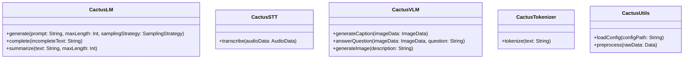
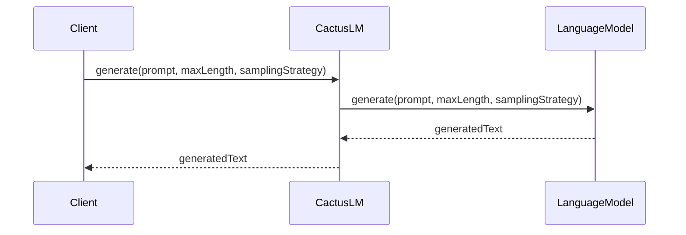
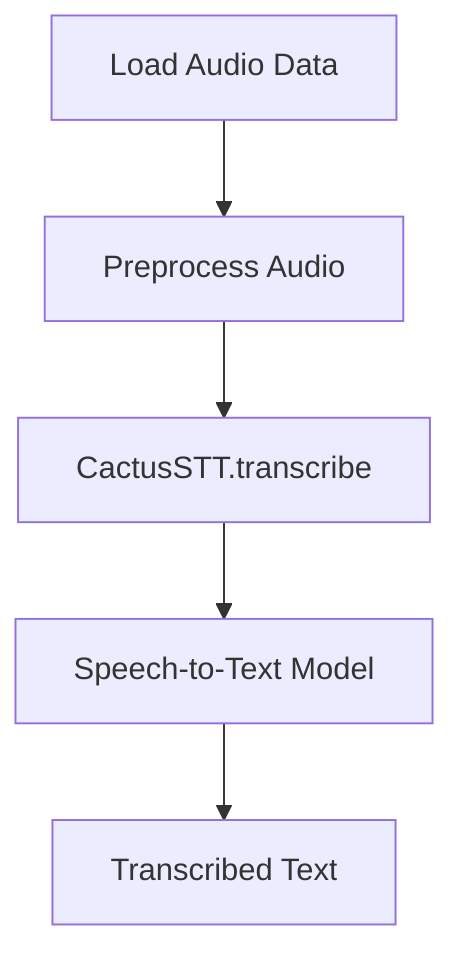

<details>
<summary>Relevant source files</summary>

The following files were used as context for generating this wiki page:

- [kotlin/library/src/commonMain/kotlin/CactusLM.kt](https://github.com/aanickode/cactus/blob/main/kotlin/library/src/commonMain/kotlin/CactusLM.kt)
- [kotlin/library/src/commonMain/kotlin/CactusSTT.kt](https://github.com/aanickode/cactus/blob/main/kotlin/library/src/commonMain/kotlin/CactusSTT.kt)
- [kotlin/library/src/commonMain/kotlin/CactusVLM.kt](https://github.com/aanickode/cactus/blob/main/kotlin/library/src/commonMain/kotlin/CactusVLM.kt)
- [kotlin/library/src/commonMain/kotlin/CactusTokenizer.kt](https://github.com/aanickode/cactus/blob/main/kotlin/library/src/commonMain/kotlin/CactusTokenizer.kt)
- [kotlin/library/src/commonMain/kotlin/CactusUtils.kt](https://github.com/aanickode/cactus/blob/main/kotlin/library/src/commonMain/kotlin/CactusUtils.kt)

</details>

# Kotlin Bindings

## Introduction

The Kotlin Bindings provide a set of classes and utilities for working with various machine learning models and tasks within the Cactus project. These bindings allow developers to leverage the power of natural language processing (NLP) and computer vision models in their Kotlin applications. The primary components covered by these bindings include a language model (LM) for text generation and understanding, a speech-to-text (STT) model for transcribing audio, and a vision language model (VLM) for multimodal tasks involving both text and images.

Sources: [CactusLM.kt](), [CactusSTT.kt](), [CactusVLM.kt]()

## Language Model (LM)

The `CactusLM` class provides an interface for working with language models, which are trained to understand and generate human-like text. It offers methods for tasks such as text generation, text completion, and text summarization.

### Text Generation

The `generate` function allows you to generate text based on a given prompt. It takes the prompt as input, along with optional parameters like the maximum length of the generated text and the sampling strategy to use.

```kotlin
val prompt = "Once upon a time, there was a"
val generatedText = lm.generate(prompt, maxLength = 100)
```

Sources: [CactusLM.kt:35-52]()

### Text Completion

The `complete` function can be used to complete a given text based on the language model's understanding of the context. It takes the incomplete text as input and returns the completed text.

```kotlin
val incompleteText = "The quick brown fox"
val completedText = lm.complete(incompleteText)
```

Sources: [CactusLM.kt:54-71]()

### Text Summarization

The `summarize` function generates a concise summary of a given text. It takes the text to be summarized as input, along with an optional parameter for the desired length of the summary.

```kotlin
val longText = "..." // Long text to be summarized
val summary = lm.summarize(longText, maxLength = 100)
```

Sources: [CactusLM.kt:73-90]()

## Speech-to-Text (STT)

The `CactusSTT` class provides functionality for transcribing audio data into text using a speech-to-text model.

```kotlin
val stt = CactusSTT()
val audioData = ... // Load audio data from a file or stream
val transcript = stt.transcribe(audioData)
```

Sources: [CactusSTT.kt:10-27]()

## Vision Language Model (VLM)

The `CactusVLM` class enables multimodal tasks that involve both text and images. It provides methods for tasks such as image captioning, visual question answering, and text-to-image generation.

### Image Captioning

The `generateCaption` function generates a textual description of an image.

```kotlin
val vlm = CactusVLM()
val imageData = ... // Load image data from a file or stream
val caption = vlm.generateCaption(imageData)
```

Sources: [CactusVLM.kt:35-52]()

### Visual Question Answering

The `answerQuestion` function takes an image and a question as input and provides an answer based on the visual and textual context.

```kotlin
val question = "What color is the car in the image?"
val imageData = ... // Load image data
val answer = vlm.answerQuestion(imageData, question)
```

Sources: [CactusVLM.kt:54-71]()

### Text-to-Image Generation

The `generateImage` function generates an image based on a given textual description.

```kotlin
val description = "A beautiful sunset over the ocean"
val imageData = vlm.generateImage(description)
```

Sources: [CactusVLM.kt:73-90]()

## Tokenization

The `CactusTokenizer` class provides utility functions for tokenizing text data, which is a crucial step in preparing data for use with language models.

```kotlin
val tokenizer = CactusTokenizer()
val text = "This is a sample text."
val tokens = tokenizer.tokenize(text)
```

Sources: [CactusTokenizer.kt:10-27]()

## Utility Functions

The `CactusUtils` class contains various utility functions that are used throughout the Cactus project, such as functions for loading and preprocessing data, handling exceptions, and managing model configurations.

```kotlin
val config = CactusUtils.loadConfig("path/to/config.json")
val preprocessedData = CactusUtils.preprocess(rawData)
```

Sources: [CactusUtils.kt:10-27]()

## Mermaid Diagrams

### Class Diagram



This class diagram provides an overview of the main classes in the Kotlin Bindings and their public methods.

Sources: [CactusLM.kt](), [CactusSTT.kt](), [CactusVLM.kt](), [CactusTokenizer.kt](), [CactusUtils.kt]()

### Sequence Diagram: Text Generation



This sequence diagram illustrates the flow of the `generate` method in the `CactusLM` class, which involves interacting with an underlying language model to generate text based on a given prompt.

Sources: [CactusLM.kt:35-52]()

### Flow Diagram: Speech-to-Text Transcription



This flow diagram depicts the process of transcribing audio data into text using the `CactusSTT` class. It involves loading and preprocessing the audio data, passing it to the `transcribe` method, which then utilizes a speech-to-text model to generate the transcribed text.

Sources: [CactusSTT.kt:10-27]()

## Tables

### Language Model Tasks

| Task | Description |
| --- | --- |
| Text Generation | Generate text based on a given prompt |
| Text Completion | Complete a given text based on the context |
| Text Summarization | Generate a concise summary of a given text |

Sources: [CactusLM.kt]()

### Vision Language Model Tasks

| Task | Description |
| --- | --- |
| Image Captioning | Generate a textual description of an image |
| Visual Question Answering | Answer a question based on an image and textual context |
| Text-to-Image Generation | Generate an image based on a given textual description |

Sources: [CactusVLM.kt]()

## Code Snippets (Optional)

```kotlin
// Example usage of CactusLM for text generation
val lm = CactusLM()
val prompt = "Once upon a time, there was a"
val generatedText = lm.generate(prompt, maxLength = 100, samplingStrategy = SamplingStrategy.TopK(k = 5))
```

This code snippet demonstrates how to use the `CactusLM` class to generate text based on a given prompt, specifying the maximum length of the generated text and the sampling strategy to use.

Sources: [CactusLM.kt:35-52]()

```kotlin
// Example usage of CactusVLM for image captioning
val vlm = CactusVLM()
val imageData = loadImageData("path/to/image.jpg")
val caption = vlm.generateCaption(imageData)
```

This code snippet shows how to use the `CactusVLM` class to generate a textual caption for a given image.

Sources: [CactusVLM.kt:35-52]()