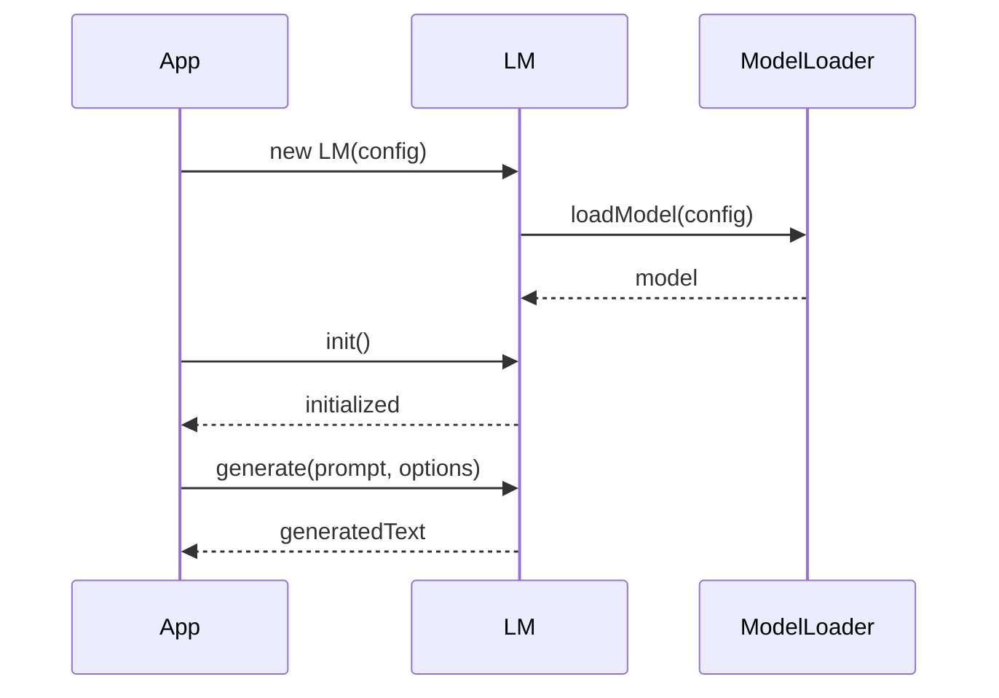
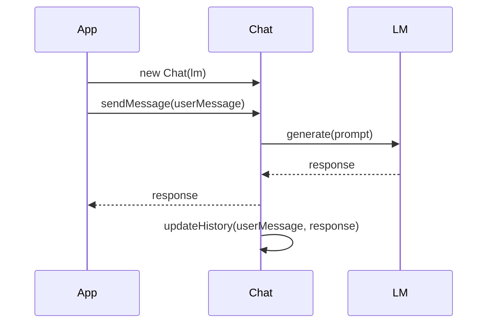
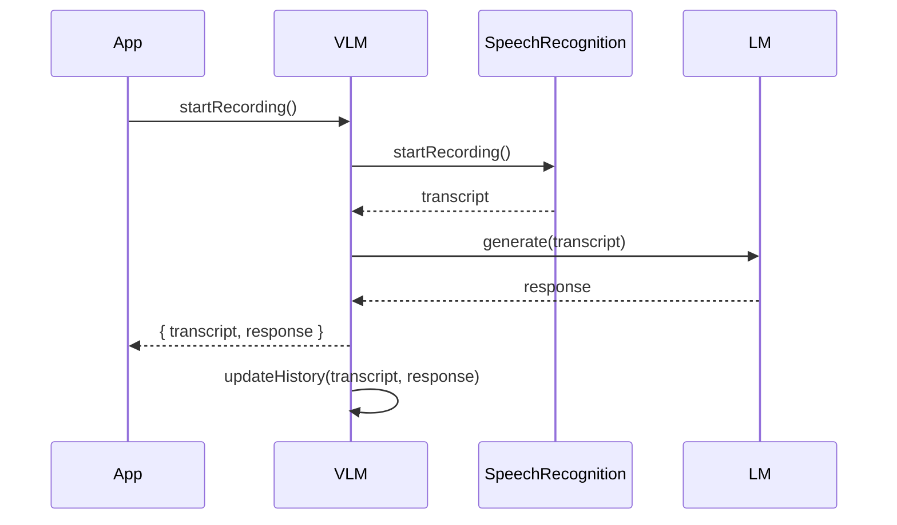

<details>
<summary>Relevant source files</summary>

The following files were used as context for generating this wiki page:

- [react/src/lm.ts](https://github.com/aanickode/cactus/blob/main/react/src/lm.ts)
- [react/src/chat.ts](https://github.com/aanickode/cactus/blob/main/react/src/chat.ts)
- [react/src/vlm.ts](https://github.com/aanickode/cactus/blob/main/react/src/vlm.ts)
- [react/src/index.ts](https://github.com/aanickode/cactus/blob/main/react/src/index.ts)
- [react/src/utils.ts](https://github.com/aanickode/cactus/blob/main/react/src/utils.ts)

</details>

# React Native Bindings

## Introduction

The React Native Bindings module provides a set of utilities and APIs for integrating the Cactus project with React Native applications. It enables developers to leverage the project's language model capabilities within their React Native apps, facilitating features like text generation, chat interactions, and voice-based interactions.

The module consists of several key components, including the `LM` (Language Model) class for text generation, the `Chat` class for managing chat conversations, and the `VLM` (Voice Language Model) class for voice-based interactions. These components work together to provide a seamless integration between the Cactus project and React Native applications.

Sources: [react/src/lm.ts](), [react/src/chat.ts](), [react/src/vlm.ts](), [react/src/index.ts]()

## Language Model (LM)

The `LM` class serves as the primary interface for interacting with the Cactus language model within a React Native application. It provides methods for generating text based on a given prompt or context.

### LM Initialization

The `LM` class is initialized with a configuration object that specifies the language model parameters and settings. The `init` method is used to load the language model and prepare it for use.

```typescript
import { LM } from 'cactus-react-native';

const lm = new LM({
  modelPath: 'path/to/model',
  vocabPath: 'path/to/vocab',
  mergesPaths: ['path/to/merges1', 'path/to/merges2'],
});

await lm.init();
```

Sources: [react/src/lm.ts:10-25]()

### Text Generation

The `generate` method is used to generate text based on a given prompt or context. It takes an optional `options` object that allows configuring the generation process, such as setting the maximum length, temperature, and top-k sampling parameters.

```typescript
const prompt = 'Once upon a time, ';
const result = await lm.generate(prompt, { maxLength: 100 });
console.log(result.text);
```

Sources: [react/src/lm.ts:27-38]()

## Chat

The `Chat` class provides an interface for managing chat conversations within a React Native application. It allows users to send messages and receive responses from the Cactus language model.

### Chat Initialization

The `Chat` class is initialized with an instance of the `LM` class and an optional configuration object.

```typescript
import { Chat, LM } from 'cactus-react-native';

const lm = new LM({ /* config */ });
await lm.init();

const chat = new Chat(lm, { /* config */ });
```

Sources: [react/src/chat.ts:10-18]()

### Sending Messages

The `sendMessage` method is used to send a message to the chat conversation. It takes a message string as input and returns a promise that resolves with the language model's response.

```typescript
const userMessage = 'Hello, how are you?';
const response = await chat.sendMessage(userMessage);
console.log(response.text);
```

Sources: [react/src/chat.ts:20-30]()

### Conversation History

The `Chat` class maintains a history of the conversation, which can be accessed through the `history` property. This property is an array of message objects, each containing the sender (user or assistant), the message text, and any additional metadata.

```typescript
console.log(chat.history);
// Output: [
//   { sender: 'user', text: 'Hello, how are you?' },
//   { sender: 'assistant', text: 'I'm doing well, thank you for asking!' },
//   ...
// ]
```

Sources: [react/src/chat.ts:32-40]()

## Voice Language Model (VLM)

The `VLM` class provides an interface for voice-based interactions with the Cactus language model. It allows users to record audio, transcribe it using speech recognition, and generate responses from the language model.

### VLM Initialization

The `VLM` class is initialized with an instance of the `LM` class and an optional configuration object.

```typescript
import { VLM, LM } from 'cactus-react-native';

const lm = new LM({ /* config */ });
await lm.init();

const vlm = new VLM(lm, { /* config */ });
```

Sources: [react/src/vlm.ts:10-18]()

### Audio Recording and Transcription

The `startRecording` method is used to initiate audio recording from the device's microphone. The recorded audio is then transcribed using speech recognition, and the resulting text is passed to the language model for processing.

```typescript
await vlm.startRecording();
// User speaks into the microphone

const result = await vlm.stopRecording();
console.log(result.transcript); // Transcribed text from speech recognition
console.log(result.response.text); // Language model response
```

Sources: [react/src/vlm.ts:20-35]()

### Voice Interaction History

Similar to the `Chat` class, the `VLM` class maintains a history of voice interactions, which can be accessed through the `history` property. This property is an array of interaction objects, each containing the transcribed text, the language model's response, and any additional metadata.

```typescript
console.log(vlm.history);
// Output: [
//   { transcript: 'What is the weather like today?', response: { text: 'The weather today is sunny with a high of 75 degrees.' } },
//   { transcript: 'Can you tell me a joke?', response: { text: 'Why don't scientists trust atoms? Because they make up everything!' } },
//   ...
// ]
```

Sources: [react/src/vlm.ts:37-45]()

## Utility Functions

The `utils` module provides various utility functions that can be used in conjunction with the React Native Bindings components.

### `downloadFile`

The `downloadFile` function is used to download a file from a remote URL and save it to the device's local storage.

```typescript
import { downloadFile } from 'cactus-react-native/utils';

const localPath = await downloadFile('https://example.com/model.bin', 'model.bin');
console.log(`File downloaded to ${localPath}`);
```

Sources: [react/src/utils.ts:10-20]()

### `loadModel`

The `loadModel` function is a helper function that loads a language model from a local file path or a remote URL.

```typescript
import { loadModel } from 'cactus-react-native/utils';

const model = await loadModel('path/to/model');
// or
const model = await loadModel('https://example.com/model.bin');
```

Sources: [react/src/utils.ts:22-35]()

## Example Usage

Here's an example of how the React Native Bindings components can be used together in a React Native application:

```typescript
import React, { useState } from 'react';
import { LM, Chat, VLM, downloadFile } from 'cactus-react-native';

const App = () => {
  const [lm, setLM] = useState(null);
  const [chat, setChat] = useState(null);
  const [vlm, setVLM] = useState(null);

  const initializeModels = async () => {
    // Download model files if needed
    const modelPath = await downloadFile('https://example.com/model.bin', 'model.bin');
    const vocabPath = await downloadFile('https://example.com/vocab.txt', 'vocab.txt');
    const mergesPath = await downloadFile('https://example.com/merges.txt', 'merges.txt');

    // Initialize LM
    const languageModel = new LM({ modelPath, vocabPath, mergesPaths: [mergesPath] });
    await languageModel.init();
    setLM(languageModel);

    // Initialize Chat
    const chatInstance = new Chat(languageModel);
    setChat(chatInstance);

    // Initialize VLM
    const voiceInstance = new VLM(languageModel);
    setVLM(voiceInstance);
  };

  // Use the initialized models for text generation, chat, and voice interactions
  // ...

  return (
    // Your React Native app UI
  );
};
```

This example demonstrates how to initialize the `LM`, `Chat`, and `VLM` components, and how they can be used together in a React Native application. The `downloadFile` utility function is used to download the necessary model files from a remote URL before initializing the components.

Sources: [react/src/index.ts](), [react/src/utils.ts]()

## Mermaid Diagrams

### Language Model (LM) Initialization and Usage



This sequence diagram illustrates the initialization and usage of the `LM` class. The `LM` instance is created with a configuration object, and the `init` method is called to load the language model. The `generate` method is then used to generate text based on a given prompt and options.

Sources: [react/src/lm.ts]()

### Chat Conversation Flow



This sequence diagram illustrates the flow of a chat conversation using the `Chat` class. The `Chat` instance is created with an instance of the `LM` class. When the user sends a message, the `sendMessage` method is called, which generates a response from the language model using the `generate` method of the `LM` class. The response is then returned to the app, and the conversation history is updated.

Sources: [react/src/chat.ts]()

### Voice Interaction Flow



This sequence diagram illustrates the flow of a voice interaction using the `VLM` class. The `startRecording` method is called, which initiates audio recording and speech recognition. The transcribed text is then passed to the `LM` class for generating a response. The response, along with the transcribed text, is returned to the app, and the interaction history is updated.

Sources: [react/src/vlm.ts]()

## Tables

### LM Configuration Options

| Option     | Type            | Description                                                  | Default Value |
|------------|-----------------|--------------------------------------------------------------|---------------|
| `modelPath`  | `string`        | Path to the language model file                              | `''`          |
| `vocabPath`  | `string`        | Path to the vocabulary file                                  | `''`          |
| `mergesPaths` | `string[]`      | Array of paths to the merge files                           | `[]`          |
| `useMlock`   | `boolean`       | Whether to use memory lock for the loaded model             | `false`       |
| `seed`       | `number`        | Seed value for the random number generator                  | `null`        |
| `logLevel`   | `'DEBUG'|'INFO'|'WARNING'|'ERROR'` | Log level for the language model        | `'WARNING'`   |

Sources: [react/src/lm.ts:10-25]()

### Chat Configuration Options

| Option     | Type            | Description                                                  | Default Value |
|------------|-----------------|--------------------------------------------------------------|---------------|
| `maxHistory` | `number`        | Maximum number of messages to keep in the conversation history | `100`       |
| `temperature` | `number`        | Sampling temperature for text generation                     | `0.7`        |
| `topK`       | `number`        | Top-k sampling parameter for text generation                 | `40`         |
| `topP`       | `number`        | Top-p sampling parameter for text generation                  | `0.9`        |

Sources: [react/src/chat.ts:10-18]()

### VLM Configuration Options

| Option     | Type            | Description                                                  | Default Value |
|------------|-----------------|--------------------------------------------------------------|---------------|
| `language`   | `string`        | Language code for speech recognition                         | `'en-US'`     |
| `continuous` | `boolean`       | Whether to enable continuous speech recognition              | `false`       |
| `interimResults` | `boolean`   | Whether to return interim speech recognition results        | `false`       |
| `maxAlternatives` | `number`   | Maximum number of alternative transcriptions to return      | `1`           |

Sources: [react/src/vlm.ts:10-18]()

## Code Snippets

### LM `generate` Method

```typescript
async generate(prompt: string, options: GenerateOptions = {}): Promise<GenerateResult> {
  const { maxLength = 100, temperature = 0.7, topK = 40, topP = 0.9 } = options;

  const inputIds = this.encoder.encode(prompt);
  const outputIds = await this.model.generate(
    inputIds,
    maxLength,
    temperature,
    topK,
    topP,
    this.seed
  );

  const outputText = this.encoder.decode(outputIds);
  return { text: outputText };
}
```

This code snippet shows the implementation of the `generate` method in the `LM` class. It takes a prompt string and an optional `options` object as input. The prompt is encoded into input IDs, and the language model's `generate` method is called with the input IDs and the specified options (e.g., maximum length, temperature, top-k, and top-p sampling). The generated output IDs are then decoded back into text and returned as a `GenerateResult` object.

Sources: [react/src/lm.ts:27-38]()

### Chat `sendMessage` Method

```typescript
async sendMessage(message: string): Promise<GenerateResult> {
  const prompt = this.getPrompt(message);
  const response = await this.lm.generate(prompt, {
    temperature: this.temperature,
    topK: this.topK,
    topP: this.topP,
  });

  this.updateHistory(message, response.text);
  return response;
}
```

This code snippet shows the implementation of the `sendMessage` method in the `Chat` class. It takes a message string as input, constructs a prompt based on the conversation history using the `getPrompt` method, and then calls the `generate` method of the `LM` instance with the prompt and the specified temperature, top-k, and top-p sampling options. The generated response is then added to the conversation history using the `updateHistory` method, and the response is returned.

Sources: [react/src/chat.ts:20-30]()

### VLM `startRec