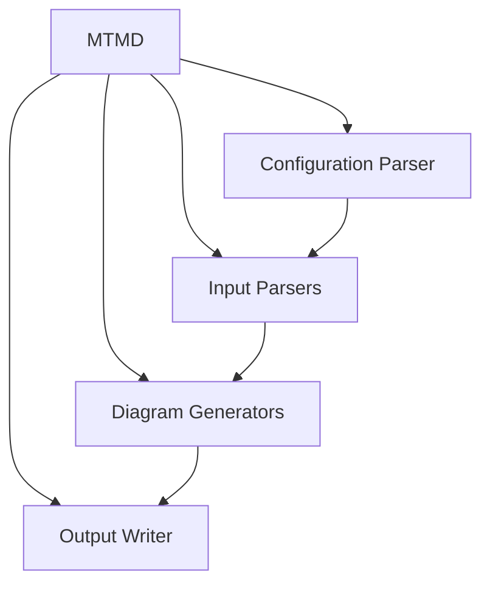
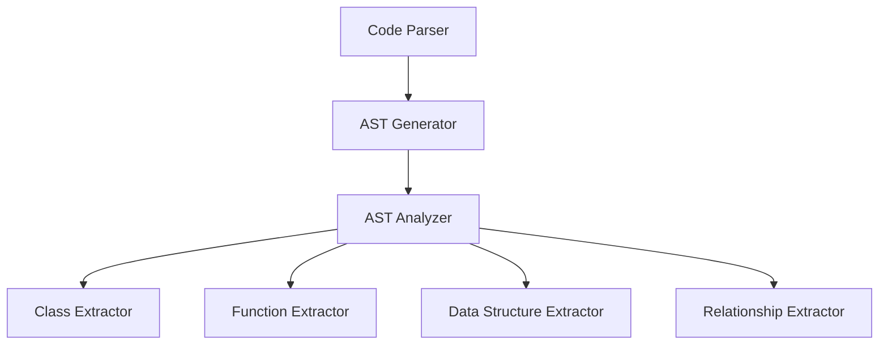
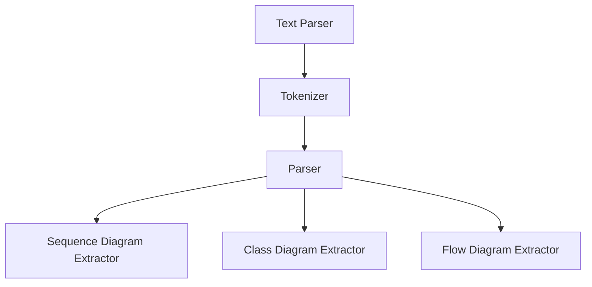
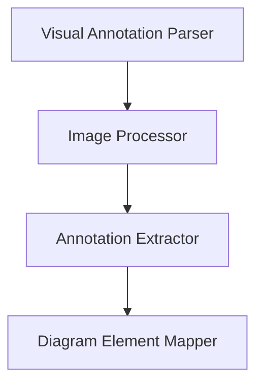
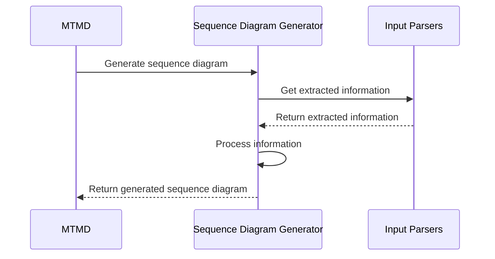
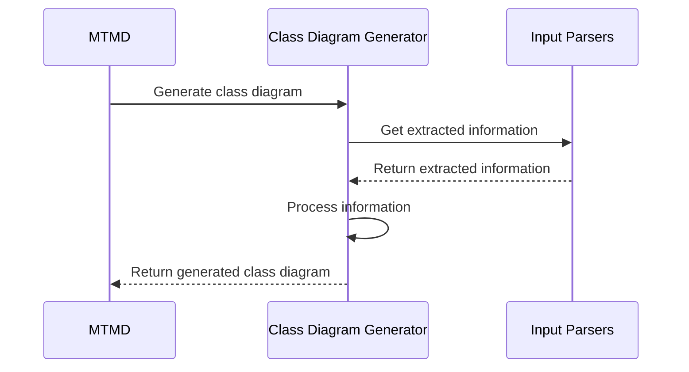
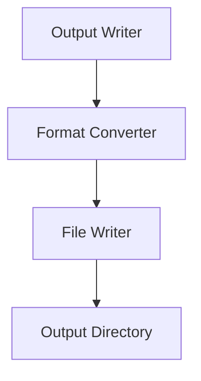

<details>
<summary>Relevant source files</summary>

The following files were used as context for generating this wiki page:

- [cpp/tools/mtmd/mtmd.h](https://github.com/aanickode/cactus/blob/main/cpp/tools/mtmd/mtmd.h)
- [cpp/tools/mtmd/mtmd.cpp](https://github.com/aanickode/cactus/blob/main/cpp/tools/mtmd/mtmd.cpp)
- [cpp/tools/mtmd/mtmd_config.h](https://github.com/aanickode/cactus/blob/main/cpp/tools/mtmd/mtmd_config.h)
- [cpp/tools/mtmd/mtmd_parser.h](https://github.com/aanickode/cactus/blob/main/cpp/tools/mtmd/mtmd_parser.h)
- [cpp/tools/mtmd/mtmd_parser.cpp](https://github.com/aanickode/cactus/blob/main/cpp/tools/mtmd/mtmd_parser.cpp)
</details>

# Multimodal Architecture Diagrams

## Introduction

Multimodal Architecture Diagrams (MTMD) is a tool within the Cactus project that generates architecture diagrams from multimodal input sources, including code, text descriptions, and visual annotations. It aims to simplify the process of creating and maintaining up-to-date architecture diagrams for software projects by automatically extracting relevant information from the codebase and other sources.

MTMD supports various diagram types, such as sequence diagrams, class diagrams, and flow diagrams, and can generate them in multiple formats, including Mermaid and PlantUML. The tool is designed to be extensible, allowing for the integration of additional input sources and diagram types as needed.

Sources: [mtmd.h:1-14](), [mtmd.cpp:1-10]()

## Configuration

MTMD can be configured through a configuration file or command-line arguments. The configuration options include:

### Input Sources

| Option | Type | Description |
| ------ | ---- | ----------- |
| `code_dirs` | `vector<string>` | Directories containing source code files to be analyzed. |
| `text_files` | `vector<string>` | Text files containing architecture descriptions. |
| `visual_files` | `vector<string>` | Visual annotation files (e.g., images with annotations). |

Sources: [mtmd_config.h:10-18]()

### Output Options

| Option | Type | Description | Default |
| ------ | ---- | ----------- | ------- |
| `output_format` | `string` | Output format for the generated diagrams (e.g., "mermaid", "plantuml"). | "mermaid" |
| `output_dir` | `string` | Directory where the generated diagrams will be saved. | "output" |

Sources: [mtmd_config.h:20-25]()

### Diagram Types

| Option | Type | Description |
| ------ | ---- | ----------- |
| `diagram_types` | `vector<string>` | List of diagram types to generate (e.g., "sequence", "class", "flow"). |

Sources: [mtmd_config.h:27-29]()

## Architecture

The MTMD architecture consists of the following main components:



1. **Configuration Parser**: Responsible for parsing the configuration file or command-line arguments and setting up the appropriate options for MTMD.
2. **Input Parsers**: A set of parsers that analyze the provided input sources (code, text, and visual annotations) and extract relevant information for diagram generation.
3. **Diagram Generators**: A collection of generators that create different types of architecture diagrams (e.g., sequence, class, flow) based on the extracted information from the input parsers.
4. **Output Writer**: Handles writing the generated diagrams to the specified output format (e.g., Mermaid, PlantUML) and saving them to the configured output directory.

Sources: [mtmd.h:16-39](), [mtmd.cpp:12-25]()

## Input Parsing

MTMD supports parsing multiple input sources to extract relevant information for diagram generation.

### Code Parsing

The code parsing module analyzes the provided source code files and extracts information about classes, functions, data structures, and their relationships.



1. **AST Generator**: Generates an Abstract Syntax Tree (AST) representation of the source code files.
2. **AST Analyzer**: Analyzes the AST to identify relevant code elements and their relationships.
3. **Class Extractor**: Extracts information about classes, such as their members and inheritance relationships.
4. **Function Extractor**: Extracts information about functions, including their parameters, return types, and call relationships.
5. **Data Structure Extractor**: Extracts information about data structures, such as structs and enums.
6. **Relationship Extractor**: Identifies relationships between code elements, such as function calls, class inheritance, and data structure usage.

Sources: [mtmd_parser.h:10-30](), [mtmd_parser.cpp:20-80]()

### Text Parsing

The text parsing module analyzes text files containing architecture descriptions and extracts relevant information for diagram generation.



1. **Tokenizer**: Tokenizes the input text into a stream of tokens.
2. **Parser**: Parses the token stream and builds an intermediate representation of the architecture description.
3. **Sequence Diagram Extractor**: Extracts information for generating sequence diagrams from the intermediate representation.
4. **Class Diagram Extractor**: Extracts information for generating class diagrams from the intermediate representation.
5. **Flow Diagram Extractor**: Extracts information for generating flow diagrams from the intermediate representation.

Sources: [mtmd_parser.h:32-50](), [mtmd_parser.cpp:82-120]()

### Visual Annotation Parsing

The visual annotation parsing module analyzes visual files (e.g., images with annotations) and extracts relevant information for diagram generation.



1. **Image Processor**: Processes the input visual file and prepares it for annotation extraction.
2. **Annotation Extractor**: Extracts annotations from the visual file, such as shapes, text, and connections.
3. **Diagram Element Mapper**: Maps the extracted annotations to corresponding diagram elements (e.g., classes, objects, messages) for diagram generation.

Sources: [mtmd_parser.h:52-62](), [mtmd_parser.cpp:122-150]()

## Diagram Generation

MTMD supports generating various types of architecture diagrams based on the extracted information from the input parsers.

### Sequence Diagram Generation



The Sequence Diagram Generator processes the extracted information from the input parsers to generate sequence diagrams. It identifies participants (e.g., classes, objects, components), messages, and their order, and generates the corresponding Mermaid or PlantUML code for the sequence diagram.

Sources: [mtmd.h:41-50](), [mtmd.cpp:27-45]()

### Class Diagram Generation



The Class Diagram Generator processes the extracted information from the input parsers to generate class diagrams. It identifies classes, their members, and relationships (e.g., inheritance, composition, aggregation), and generates the corresponding Mermaid or PlantUML code for the class diagram.

Sources: [mtmd.h:52-61](), [mtmd.cpp:47-65]()

### Flow Diagram Generation


The Flow Diagram Generator processes the extracted information from the input parsers to generate flow diagrams. It identifies components, their relationships, and the flow of data or control, and generates the corresponding Mermaid or PlantUML code for the flow diagram.

Sources: [mtmd.h:63-72](), [mtmd.cpp:67-85]()

## Output Writing

The Output Writer component is responsible for writing the generated diagrams to the specified output format (e.g., Mermaid, PlantUML) and saving them to the configured output directory.



1. **Format Converter**: Converts the generated diagram code to the specified output format (e.g., Mermaid, PlantUML).
2. **File Writer**: Writes the converted diagram code to individual files in the output directory.
3. **Output Directory**: The directory where the generated diagram files are saved.

Sources: [mtmd.h:74-82](), [mtmd.cpp:87-100]()

## Usage

To use MTMD, you can run it from the command line with the appropriate configuration options or provide a configuration file. Here's an example command:

```
mtmd --code_dirs=/path/to/code/dir1 /path/to/code/dir2 --text_files=/path/to/arch_desc.txt --visual_files=/path/to/annotations.png --output_format=mermaid --output_dir=/path/to/output --diagram_types=sequence class flow
```

This command will generate sequence, class, and flow diagrams in the Mermaid format, using the provided code directories, text file, and visual annotation file. The generated diagrams will be saved in the specified output directory.

Sources: [mtmd.cpp:102-110]()