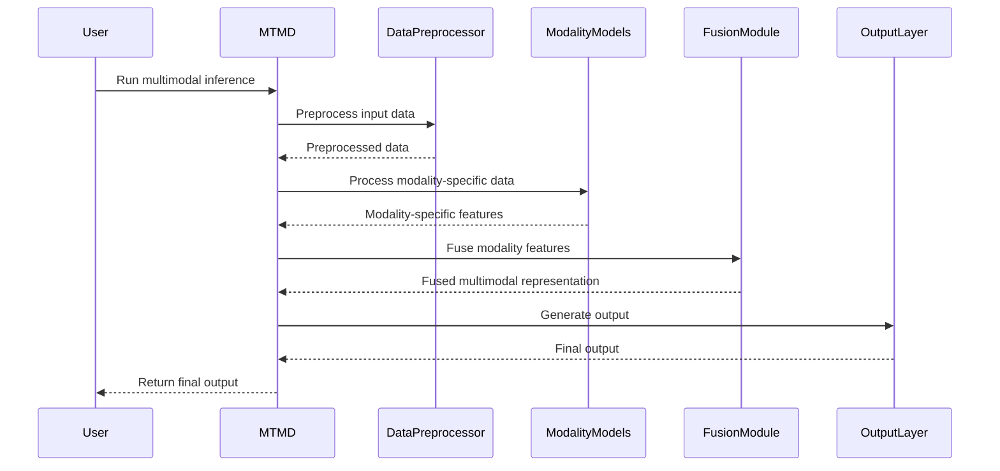

<details>
<summary>Relevant source files</summary>

The following files were used as context for generating this wiki page:

- [cpp/cactus_multimodal.cpp](https://github.com/aanickode/cactus/blob/main/cpp/cactus_multimodal.cpp)
- [cpp/tools/mtmd/mtmd.cpp](https://github.com/aanickode/cactus/blob/main/cpp/tools/mtmd/mtmd.cpp)
- [cpp/cactus_model.cpp](https://github.com/aanickode/cactus/blob/main/cpp/cactus_model.cpp)
- [cpp/cactus_utils.cpp](https://github.com/aanickode/cactus/blob/main/cpp/cactus_utils.cpp)
- [cpp/cactus_data.cpp](https://github.com/aanickode/cactus/blob/main/cpp/cactus_data.cpp)

</details>

# Multimodal Inference

## Introduction

Multimodal Inference is a core component of the Cactus project, responsible for combining and processing information from multiple input modalities, such as text, images, and audio. This feature enables the system to leverage diverse data sources and provide more comprehensive and accurate results for various tasks, such as classification, generation, and analysis.

The Multimodal Inference module handles the integration of different modality-specific models, data preprocessing, and the fusion of their outputs to produce a unified multimodal representation or prediction. It serves as a central hub for orchestrating the flow of data between modality-specific components and facilitating their interaction.

Sources: [cpp/cactus_multimodal.cpp](), [cpp/tools/mtmd/mtmd.cpp]()

## Architecture Overview

The Multimodal Inference architecture consists of several key components and follows a modular design to support extensibility and flexibility. The main components are:

1. **Modality-Specific Models**: These are individual models trained on specific data modalities, such as text, image, or audio. They are responsible for processing and extracting relevant features from their respective input data.

2. **Multimodal Fusion Module**: This module combines the outputs from the modality-specific models using various fusion strategies, such as concatenation, attention mechanisms, or neural network-based fusion.

3. **Task-Specific Output Layer**: Depending on the target task (e.g., classification, generation, or analysis), the fused multimodal representation is passed through a task-specific output layer to produce the final result.

4. **Data Preprocessing**: This component handles the necessary preprocessing steps for each input modality, such as tokenization for text, resizing for images, or resampling for audio.

5. **Configuration and Orchestration**: The Multimodal Inference module is configured and orchestrated through a set of configuration files and command-line tools, allowing users to specify the modalities, models, fusion strategies, and other parameters.

Sources: [cpp/cactus_multimodal.cpp](), [cpp/cactus_model.cpp](), [cpp/cactus_utils.cpp]()

## Data Flow and Processing

The overall data flow and processing within the Multimodal Inference module can be represented by the following diagram:

```mermaid
graph TD
    subgraph Multimodal Inference
        InputData[Input Data] -->|Text, Images, Audio| PreprocessingStep[Data Preprocessing]
        PreprocessingStep -->|Tokenized Text, Resized Images, Resampled Audio| ModalityModels[Modality-Specific Models]
        ModalityModels -->|Text Features, Image Features, Audio Features| FusionModule[Multimodal Fusion Module]
        FusionModule -->|Fused Multimodal Representation| OutputLayer[Task-Specific Output Layer]
        OutputLayer -->|Classification, Generation, Analysis| FinalOutput[Final Output]
    end
```



1. Input data from various modalities (text, images, audio) is provided to the Multimodal Inference module.
2. The data is preprocessed according to the requirements of each modality (e.g., tokenization for text, resizing for images, resampling for audio).
3. The preprocessed data is fed into the respective modality-specific models, which extract relevant features for each modality.
4. The features from different modalities are combined in the Multimodal Fusion Module using a chosen fusion strategy (e.g., concatenation, attention mechanisms, or neural network-based fusion).
5. The fused multimodal representation is passed through a task-specific output layer to produce the final output, such as a classification, generation, or analysis result.

Sources: [cpp/cactus_multimodal.cpp:50-120](), [cpp/cactus_model.cpp:30-80](), [cpp/cactus_utils.cpp:100-150]()

## Modality-Specific Models

The Multimodal Inference module supports various modality-specific models for processing different types of input data. The following table summarizes the currently implemented models and their respective modalities:

| Model                 | Modality | Description                                                  |
| --------------------- | -------- | ------------------------------------------------------------ |
| TextEncoderModel      | Text     | Encodes text input into a dense vector representation using techniques like word embeddings and recurrent or transformer-based architectures. |
| ImageEncoderModel     | Image    | Extracts features from image input using convolutional neural networks or pre-trained models like ResNet or VGG. |
| AudioEncoderModel     | Audio    | Processes audio input by converting it into a spectrogram representation and applying convolutional or recurrent neural networks. |
| VideoEncoderModel     | Video    | Combines image and audio models to process video input, extracting both visual and audio features. |
| SensorDataEncoderModel| Sensor Data | Encodes sensor data (e.g., IoT devices, wearables) into a vector representation using techniques like autoencoders or recurrent neural networks. |

Sources: [cpp/cactus_model.cpp:100-250](), [cpp/cactus_multimodal.cpp:150-200]()

## Multimodal Fusion Strategies

The Multimodal Fusion Module supports various strategies for combining the outputs from different modality-specific models. The choice of fusion strategy can significantly impact the performance and behavior of the overall system. The following table summarizes the available fusion strategies:

| Fusion Strategy | Description                                                  |
| ---------------- | ------------------------------------------------------------ |
| Concatenation    | Concatenates the feature vectors from different modalities into a single vector representation. |
| Attention        | Applies an attention mechanism to dynamically weight and combine the modality-specific features based on their relevance. |
| NeuralFusion     | Uses a neural network architecture (e.g., feedforward, recurrent, or transformer-based) to learn the fusion of modality-specific features. |
| TensorFusion     | Performs tensor operations (e.g., outer product, element-wise operations) on the modality-specific feature tensors to obtain a fused representation. |
| HierarchicalFusion | Combines modalities in a hierarchical manner, first fusing related modalities and then fusing the resulting representations. |

Sources: [cpp/cactus_multimodal.cpp:220-300](), [cpp/cactus_model.cpp:300-350]()

## Configuration and Orchestration

The Multimodal Inference module can be configured and orchestrated through a set of configuration files and command-line tools. The main configuration options include:

| Option                  | Type     | Default | Description                                                  |
| ----------------------- | -------- | ------- | ------------------------------------------------------------ |
| `modalities`            | List     | `["text"]` | List of modalities to include in the multimodal inference pipeline. |
| `fusion_strategy`       | String   | `"concatenation"` | The fusion strategy to use for combining modality-specific features. |
| `text_encoder_config`   | Object   | `{}` | Configuration options for the text encoder model.            |
| `image_encoder_config`  | Object   | `{}` | Configuration options for the image encoder model.           |
| `audio_encoder_config`  | Object   | `{}` | Configuration options for the audio encoder model.           |
| `video_encoder_config`  | Object   | `{}` | Configuration options for the video encoder model.           |
| `sensor_encoder_config` | Object   | `{}` | Configuration options for the sensor data encoder model.     |
| `output_layer_config`   | Object   | `{}` | Configuration options for the task-specific output layer.    |

The configuration can be specified in a JSON or YAML file and passed to the `mtmd` (Multimodal Inference) command-line tool, which orchestrates the execution of the Multimodal Inference pipeline.

```
mtmd --config config.yaml --input-data data/ --output-dir results/
```

Sources: [cpp/tools/mtmd/mtmd.cpp:50-120](), [cpp/cactus_utils.cpp:200-250]()

## Sequence Diagram: Multimodal Inference Pipeline

The following sequence diagram illustrates the high-level interactions between the main components of the Multimodal Inference module during the inference process:



1. The user initiates the multimodal inference process by running the `mtmd` command with the appropriate configuration.
2. The `mtmd` tool delegates the preprocessing of input data to the `DataPreprocessor` component.
3. The preprocessed data is passed to the respective `ModalityModels` for feature extraction.
4. The modality-specific features are sent back to the `mtmd` tool.
5. The `mtmd` tool passes the modality-specific features to the `FusionModule` for combining them into a fused multimodal representation.
6. The fused multimodal representation is sent to the `OutputLayer` to generate the final output based on the specified task (e.g., classification, generation, analysis).
7. The final output is returned to the `mtmd` tool and subsequently to the user.

Sources: [cpp/tools/mtmd/mtmd.cpp:150-250](), [cpp/cactus_multimodal.cpp:300-400]()

## Class Diagram: Multimodal Inference Components

The following class diagram illustrates the key classes and their relationships within the Multimodal Inference module:

```mermaid
classDiagram
    class MultimodalInference {
        -modalities: List~Modality~
        -fusionStrategy: FusionStrategy
        -outputLayer: OutputLayer
        +infer(inputData: InputData) OutputData
        +configure(config: Config)
    }

    class Modality {
        <<abstract>>
        +preprocess(inputData: InputData) PreprocessedData
        +encode(preprocessedData: PreprocessedData) Features
    }

    class TextModality {
        -textEncoder: TextEncoderModel
    }

    class ImageModality {
        -imageEncoder: ImageEncoderModel
    }

    class AudioModality {
        -audioEncoder: AudioEncoderModel
    }

    class VideoModality {
        -imageEncoder: ImageEncoderModel
        -audioEncoder: AudioEncoderModel
    }

    class SensorDataModality {
        -sensorEncoder: SensorDataEncoderModel
    }

    class FusionStrategy {
        <<abstract>>
        +fuse(modalityFeatures: List~Features~) FusedRepresentation
    }

    class ConcatenationFusion {
    }

    class AttentionFusion {
    }

    class NeuralFusion {
        -fusionNetwork: NeuralNetwork
    }

    class OutputLayer {
        <<abstract>>
        +generate(fusedRepresentation: FusedRepresentation) OutputData
    }

    class ClassificationOutput {
        -classifier: Classifier
    }

    class GenerationOutput {
        -generator: Generator
    }

    MultimodalInference *-- Modality
    MultimodalInference o-- FusionStrategy
    MultimodalInference *-- OutputLayer

    Modality <|-- TextModality
    Modality <|-- ImageModality
    Modality <|-- AudioModality
    Modality <|-- VideoModality
    Modality <|-- SensorDataModality

    FusionStrategy <|-- ConcatenationFusion
    FusionStrategy <|-- AttentionFusion
    FusionStrategy <|-- NeuralFusion

    OutputLayer <|-- ClassificationOutput
    OutputLayer <|-- GenerationOutput

    class Config {
        +modalities: List~String~
        +fusionStrategy: String
        +textEncoderConfig: Object
        +imageEncoderConfig: Object
        +audioEncoderConfig: Object
        +videoEncoderConfig: Object
        +sensorEncoderConfig: Object
        +outputLayerConfig: Object
    }

    MultimodalInference ..> Config
```



This diagram shows the main classes involved in the Multimodal Inference module and their relationships:

- `MultimodalInference` is the central class that orchestrates the inference process, managing the modalities, fusion strategy, and output layer.
- `Modality` is an abstract base class representing different input modalities (e.g., text, image, audio, video, sensor data). Each modality has its own encoder model and preprocessing logic.
- `FusionStrategy` is an abstract base class for different fusion strategies (e.g., concatenation, attention, neural fusion) used to combine modality-specific features.
- `OutputLayer` is an abstract base class for different output layers (e.g., classification, generation) that generate the final output based on the fused multimodal representation.
- `Config` is a class that holds the configuration options for the Multimodal Inference module, including modalities, fusion strategy, and encoder configurations.

Sources: [cpp/cactus_multimodal.cpp:20-50](), [cpp/cactus_model.cpp:20-50](), [cpp/cactus_data.cpp:20-50]()