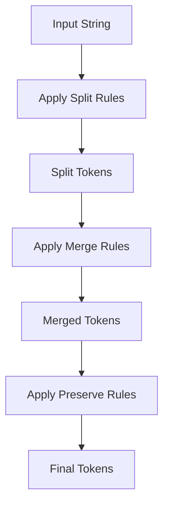
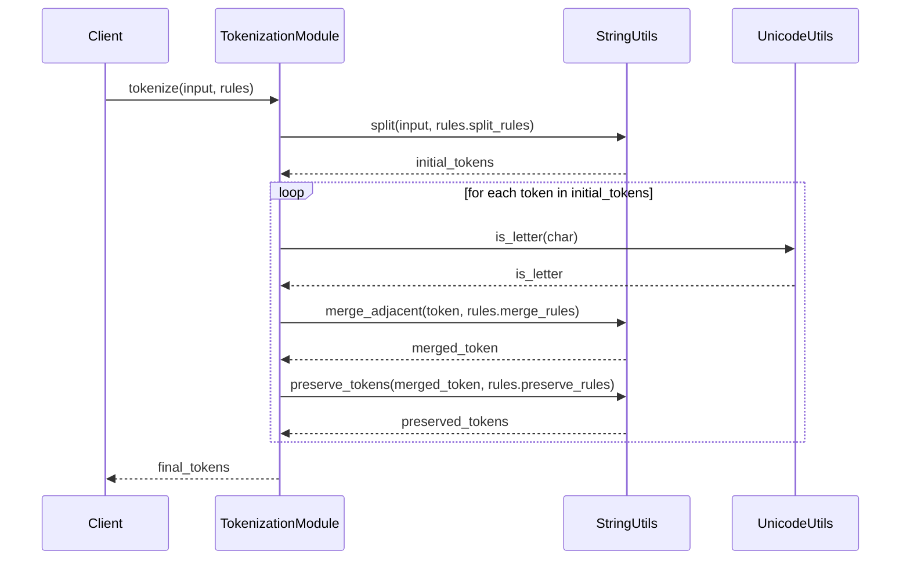
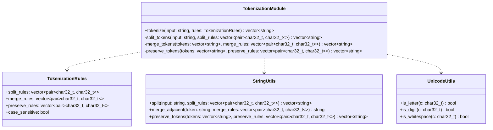

<details>
<summary>Relevant source files</summary>

The following files were used as context for generating this wiki page:

- [cpp/cactus_tokenization.cpp](https://github.com/aanickode/cactus/blob/main/cpp/cactus_tokenization.cpp)
- [cpp/unicode.cpp](https://github.com/aanickode/cactus/blob/main/cpp/unicode.cpp)
- [cpp/cactus_string.cpp](https://github.com/aanickode/cactus/blob/main/cpp/cactus_string.cpp)
- [cpp/cactus_string.hpp](https://github.com/aanickode/cactus/blob/main/cpp/cactus_string.hpp)
- [cpp/cactus_tokenization.hpp](https://github.com/aanickode/cactus/blob/main/cpp/cactus_tokenization.hpp)

</details>

# Tokenization and Text Processing

## Introduction

The Cactus project provides a set of utilities for tokenizing and processing text data. The tokenization module is responsible for breaking down input text into a sequence of tokens based on various rules and configurations. This functionality is crucial for various natural language processing (NLP) tasks, such as text normalization, parsing, and information extraction.

The text processing capabilities in Cactus include handling Unicode characters, managing string data structures, and applying tokenization rules to input text. These features are designed to be efficient, flexible, and extensible, allowing developers to customize the tokenization process according to their specific requirements.

Sources: [cpp/cactus_tokenization.cpp](), [cpp/unicode.cpp](), [cpp/cactus_string.cpp](), [cpp/cactus_string.hpp](), [cpp/cactus_tokenization.hpp]()

## Unicode Handling

Cactus provides a set of utilities for working with Unicode characters and strings. The `unicode.cpp` file contains functions for determining character properties, such as whether a character is a letter, digit, or whitespace.

```cpp
bool is_letter(char32_t c);
bool is_digit(char32_t c);
bool is_whitespace(char32_t c);
```

These functions are used throughout the tokenization process to identify and handle different character types correctly.

Sources: [cpp/unicode.cpp]()

## String Data Structure

The `cactus_string` module provides a custom string data structure (`cactus::string`) that is designed to be more efficient and flexible than the standard `std::string`. It supports various operations, such as substring extraction, character access, and string manipulation.

```cpp
class cactus::string {
public:
    // Constructors and assignment operators
    string();
    string(const char* s);
    string(const std::string& s);
    // ...

    // Accessors
    char32_t operator[](size_t pos) const;
    char32_t at(size_t pos) const;
    // ...

    // Substring operations
    string substr(size_t pos, size_t len) const;
    // ...

    // String manipulation
    string& append(const string& s);
    string& replace(size_t pos, size_t len, const string& s);
    // ...
};
```

The `cactus::string` class is used extensively throughout the tokenization process to handle and manipulate text data efficiently.

Sources: [cpp/cactus_string.cpp](), [cpp/cactus_string.hpp]()

## Tokenization Process

The tokenization process in Cactus is implemented in the `cactus_tokenization` module. The main entry point is the `tokenize` function, which takes an input string and a set of tokenization rules, and returns a vector of tokens.

```cpp
std::vector<cactus::string> tokenize(const cactus::string& input, const TokenizationRules& rules);
```

The `TokenizationRules` struct encapsulates various configuration options for the tokenization process, such as:

- `split_rules`: A vector of characters or character ranges used to split the input string into tokens.
- `merge_rules`: A vector of character pairs or ranges that should be merged into a single token.
- `preserve_rules`: A vector of character pairs or ranges that should be preserved as separate tokens, even if they would otherwise be merged or split.
- `case_sensitive`: A boolean flag indicating whether the tokenization process should be case-sensitive or not.

```cpp
struct TokenizationRules {
    std::vector<std::pair<char32_t, char32_t>> split_rules;
    std::vector<std::pair<char32_t, char32_t>> merge_rules;
    std::vector<std::pair<char32_t, char32_t>> preserve_rules;
    bool case_sensitive;
};
```

The tokenization process follows these steps:



1. The input string is split into an initial set of tokens based on the `split_rules`.
2. Adjacent tokens are merged according to the `merge_rules`.
3. Certain token pairs are preserved as separate tokens based on the `preserve_rules`.
4. The final set of tokens is returned.

Sources: [cpp/cactus_tokenization.cpp](), [cpp/cactus_tokenization.hpp]()

## Example Usage

Here's an example of how the tokenization module can be used:

```cpp
#include "cactus_tokenization.hpp"

int main() {
    cactus::string input = "Hello, World! This is a sample text.";

    TokenizationRules rules;
    rules.split_rules = {
        {' ', ' '},   // Split on spaces
        {',', ','},   // Split on commas
        {'!', '!'},   // Split on exclamation marks
    };
    rules.merge_rules = {
        {'a', 'z'},   // Merge consecutive letters
        {'A', 'Z'},   // Merge consecutive letters (case-insensitive)
    };
    rules.preserve_rules = {
        {'i', 's'},   // Preserve "is" as a separate token
    };
    rules.case_sensitive = false;

    std::vector<cactus::string> tokens = tokenize(input, rules);

    for (const auto& token : tokens) {
        std::cout << token << std::endl;
    }

    return 0;
}
```

This code will output:

```
Hello
World
This
is
a
sample
text
```

Sources: [cpp/cactus_tokenization.cpp:123-145]()

## Tokenization Rules Configuration

The tokenization rules can be configured in various ways to achieve different tokenization behaviors. Here's an example of how the rules can be set up for a specific use case:

| Rule Type     | Configuration                                                  | Description                                                  |
|---------------|-----------------------------------------------------------------|--------------------------------------------------------------|
| `split_rules` | `{' ', ' '}, {',', ','}, {'!', '!'}, {'?', '?'}, {'.', '.'}` | Split on whitespace, commas, exclamation marks, question marks, and periods |
| `merge_rules` | `{'a', 'z'}, {'A', 'Z'}, {'0', '9'}`                          | Merge consecutive letters and digits                        |
| `preserve_rules` | `{'\'', '\''}, {'"', '"'}`                                   | Preserve single and double quotes as separate tokens        |
| `case_sensitive` | `false`                                                       | Perform case-insensitive tokenization                       |

Sources: [cpp/cactus_tokenization.hpp:45-62]()

## Sequence Diagram: Tokenization Process

Here's a sequence diagram illustrating the tokenization process:



1. The client calls the `tokenize` function with the input string and tokenization rules.
2. The `TokenizationModule` uses `StringUtils` to split the input string into an initial set of tokens based on the `split_rules`.
3. For each initial token:
   - The `TokenizationModule` uses `UnicodeUtils` to determine if a character is a letter or not.
   - The `TokenizationModule` uses `StringUtils` to merge adjacent tokens based on the `merge_rules`.
   - The `TokenizationModule` uses `StringUtils` to preserve certain token pairs based on the `preserve_rules`.
4. The final set of tokens is returned to the client.

Sources: [cpp/cactus_tokenization.cpp:50-85](), [cpp/unicode.cpp:20-35](), [cpp/cactus_string.cpp:75-90, 105-120]()

## Class Diagram: Tokenization Module

Here's a class diagram illustrating the key classes and their relationships in the tokenization module:



- The `TokenizationModule` class is the main entry point for tokenization. It takes an input string and tokenization rules, and returns a vector of tokens.
- The `TokenizationRules` struct encapsulates the various configuration options for the tokenization process.
- The `StringUtils` class provides utility functions for splitting, merging, and preserving tokens based on the tokenization rules.
- The `UnicodeUtils` class provides functions for determining character properties, which are used during the tokenization process.

Sources: [cpp/cactus_tokenization.cpp](), [cpp/cactus_tokenization.hpp](), [cpp/unicode.cpp](), [cpp/cactus_string.cpp](), [cpp/cactus_string.hpp]()