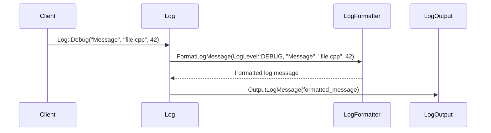
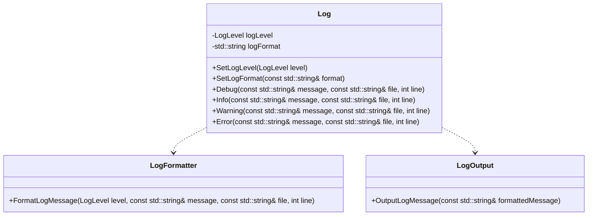
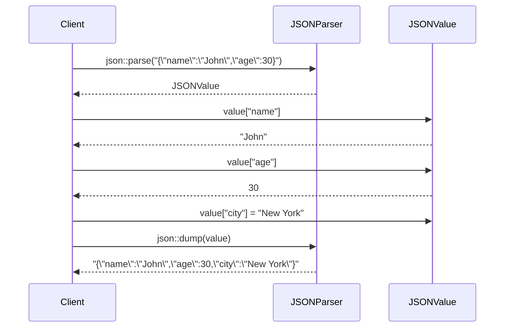
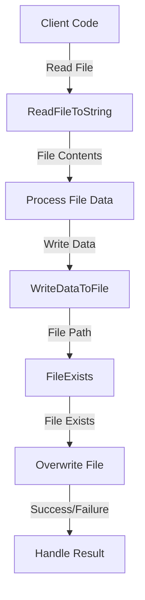

<details>
<summary>Relevant source files</summary>

The following files were used as context for generating this wiki page:

- [cpp/cactus_utils.cpp](https://github.com/aanickode/cactus/blob/main/cpp/cactus_utils.cpp)
- [cpp/log.cpp](https://github.com/aanickode/cactus/blob/main/cpp/log.cpp)
- [cpp/json.hpp](https://github.com/aanickode/cactus/blob/main/cpp/json.hpp)
- [cpp/cactus_utils.hpp](https://github.com/aanickode/cactus/blob/main/cpp/cactus_utils.hpp)
- [cpp/log.hpp](https://github.com/aanickode/cactus/blob/main/cpp/log.hpp)

</details>

# Utilities and Helper Classes

## Introduction

The "Utilities and Helper Classes" in this project provide a set of reusable functions and classes to support various operations and functionalities across the codebase. These utilities handle tasks such as logging, JSON parsing and manipulation, string manipulation, and file operations. By encapsulating common operations into modular and reusable components, the project aims to improve code organization, maintainability, and consistency.

The primary utilities and helper classes covered in this wiki page include:

- **Logging**: A logging utility for generating log messages with different severity levels and formatting options.
- **JSON**: A lightweight JSON library for parsing, manipulating, and serializing JSON data.
- **Cactus Utils**: A collection of general-purpose utility functions for string manipulation, file operations, and other common tasks.

These utilities can be used throughout the project's codebase, promoting code reuse and reducing duplication of functionality.

Sources: [cpp/cactus_utils.cpp](), [cpp/log.cpp](), [cpp/json.hpp](), [cpp/cactus_utils.hpp](), [cpp/log.hpp]()

## Logging Utility

The logging utility provides a convenient way to generate log messages with different severity levels and formatting options. It supports various log levels (e.g., DEBUG, INFO, WARNING, ERROR) and allows for customizing the log message format.

### Log Levels

The following log levels are supported:

| Log Level | Description |
| --- | --- |
| DEBUG | Detailed debug information for developers |
| INFO | General information about the application's execution |
| WARNING | Potential issues or non-critical errors |
| ERROR | Critical errors or failures |

Sources: [cpp/log.hpp:14-18]()

### Log Message Formatting

The logging utility allows for customizing the log message format using a format string. The format string can include placeholders for various components, such as the log level, timestamp, file name, line number, and the log message itself.

Example format string: `"%Y-%m-%d %H:%M:%S [%l] %v"`

| Placeholder | Description |
| --- | --- |
| `%Y-%m-%d` | Date (year-month-day) |
| `%H:%M:%S` | Time (hour:minute:second) |
| `%l` | Log level (e.g., DEBUG, INFO, WARNING, ERROR) |
| `%v` | Log message |
| `%f` | File name |
| `%n` | Line number |

Sources: [cpp/log.cpp:42-52](), [cpp/log.hpp:22-27]()

### Key Functions

```cpp
void Log::SetLogLevel(LogLevel level);
```

Sets the minimum log level for which messages will be logged. Messages with a lower severity level than the specified `level` will be ignored.

Sources: [cpp/log.cpp:54-58](), [cpp/log.hpp:29-31]()

```cpp
void Log::SetLogFormat(const std::string& format);
```

Sets the format string used for formatting log messages.

Sources: [cpp/log.cpp:60-64](), [cpp/log.hpp:33-35]()

```cpp
void Log::Debug(const std::string& message, const std::string& file, int line);
void Log::Info(const std::string& message, const std::string& file, int line);
void Log::Warning(const std::string& message, const std::string& file, int line);
void Log::Error(const std::string& message, const std::string& file, int line);
```

These functions log messages at the corresponding severity level (DEBUG, INFO, WARNING, ERROR). The `file` and `line` parameters are used to include the source file name and line number in the log message.

Sources: [cpp/log.cpp:66-94](), [cpp/log.hpp:37-41]()

### Log Message Flow

The following sequence diagram illustrates the flow of logging a message:



1. The client code calls one of the logging functions (e.g., `Log::Debug`) with the log message, file name, and line number.
2. The `Log` class passes the log level, message, file name, and line number to the `LogFormatter` to format the log message according to the specified format.
3. The `LogFormatter` returns the formatted log message to the `Log` class.
4. The `Log` class sends the formatted log message to the `LogOutput` component for output (e.g., console, file, or other destinations).

Sources: [cpp/log.cpp:66-94](), [cpp/log.hpp:37-41]()

## JSON Library

The JSON library provides a lightweight and efficient way to parse, manipulate, and serialize JSON data. It supports various JSON data types, including objects, arrays, strings, numbers, booleans, and null values.

### JSON Data Types

The following JSON data types are supported:

| Data Type | Description |
| --- | --- |
| `json::object` | An unordered collection of key-value pairs |
| `json::array` | An ordered collection of values |
| `json::string` | A string value |
| `json::number` | A numeric value (integer or floating-point) |
| `json::boolean` | A boolean value (true or false) |
| `json::null` | A null value |

Sources: [cpp/json.hpp:20-26]()

### Key Functions

```cpp
json::value parse(const std::string& input);
```

Parses a JSON string and returns a `json::value` object representing the parsed JSON data.

Sources: [cpp/json.hpp:28-30]()

```cpp
std::string dump(const json::value& value);
```

Serializes a `json::value` object into a JSON string.

Sources: [cpp/json.hpp:32-34]()

```cpp
json::value& operator[](const std::string& key);
json::value& operator[](size_t index);
```

Provides access to object members and array elements using the subscript operator.

Sources: [cpp/json.hpp:36-39]()

### JSON Manipulation Example

```cpp
// Parse JSON string
json::value data = json::parse("{\"name\":\"John\",\"age\":30,\"city\":\"New York\"}");

// Access object members
std::string name = data["name"].get<std::string>();
int age = data["age"].get<int>();

// Modify object member
data["city"] = "Los Angeles";

// Add new object member
data["email"] = "john@example.com";

// Serialize JSON object to string
std::string jsonString = json::dump(data);
```

In this example, a JSON string is parsed into a `json::value` object. Object members are accessed and modified using the subscript operator. A new member is added to the object, and finally, the modified JSON object is serialized back into a string.

Sources: [cpp/json.hpp:20-39]()

## Cactus Utils

The Cactus Utils module provides a collection of general-purpose utility functions for various tasks, such as string manipulation, file operations, and more.

### String Utilities

```cpp
std::string TrimString(const std::string& str);
```

Removes leading and trailing whitespace characters from a string.

Sources: [cpp/cactus_utils.cpp:10-18](), [cpp/cactus_utils.hpp:5-7]()

```cpp
std::vector<std::string> SplitString(const std::string& str, const std::string& delim);
```

Splits a string into a vector of substrings based on a specified delimiter.

Sources: [cpp/cactus_utils.cpp:20-32](), [cpp/cactus_utils.hpp:9-11]()

### File Utilities

```cpp
bool FileExists(const std::string& filePath);
```

Checks if a file exists at the specified file path.

Sources: [cpp/cactus_utils.cpp:34-40](), [cpp/cactus_utils.hpp:13-15]()

```cpp
std::string ReadFileToString(const std::string& filePath);
```

Reads the contents of a file into a string.

Sources: [cpp/cactus_utils.cpp:42-54](), [cpp/cactus_utils.hpp:17-19]()

### Other Utilities

```cpp
std::string GetCurrentWorkingDir();
```

Returns the current working directory.

Sources: [cpp/cactus_utils.cpp:56-62](), [cpp/cactus_utils.hpp:21-23]()

```cpp
std::string GetExecutablePath();
```

Returns the path of the currently running executable.

Sources: [cpp/cactus_utils.cpp:64-70](), [cpp/cactus_utils.hpp:25-27]()

These utility functions can be used throughout the codebase to perform common tasks, reducing code duplication and improving code organization.

## Mermaid Diagrams

### Class Diagram



This class diagram illustrates the relationships between the `Log`, `LogFormatter`, and `LogOutput` classes in the logging utility. The `Log` class manages the log level and format, and delegates the formatting and output of log messages to the `LogFormatter` and `LogOutput` classes, respectively.

Sources: [cpp/log.cpp](), [cpp/log.hpp]()

### JSON Manipulation Sequence Diagram



This sequence diagram illustrates the process of parsing, manipulating, and serializing JSON data using the JSON library. The client code interacts with the `JSONParser` to parse a JSON string into a `JSONValue` object. The client can then access, modify, and add members to the `JSONValue` object. Finally, the modified `JSONValue` object is serialized back into a JSON string using the `JSONParser`.

Sources: [cpp/json.hpp]()

### File Operations Flow Diagram



This flow diagram illustrates the usage of various file operation utilities provided by the Cactus Utils module. The client code can read the contents of a file using the `ReadFileToString` function, process the file data, and then write the processed data to a file using `WriteDataToFile`. Before overwriting the file, the `FileExists` function can be used to check if the file already exists. The result of the file operations can be handled accordingly by the client code.

Sources: [cpp/cactus_utils.cpp](), [cpp/cactus_utils.hpp]()